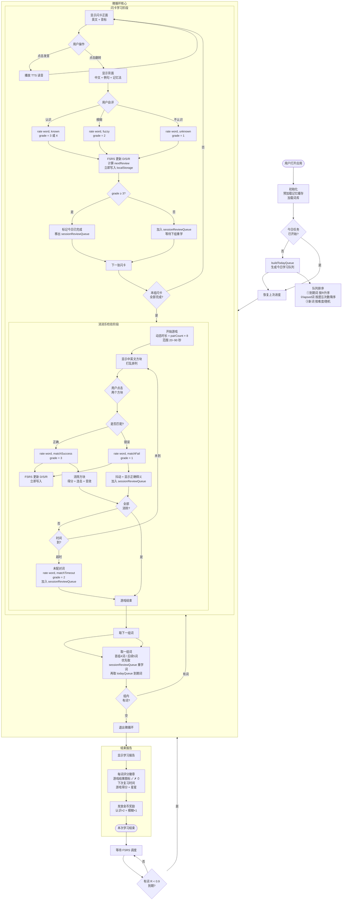
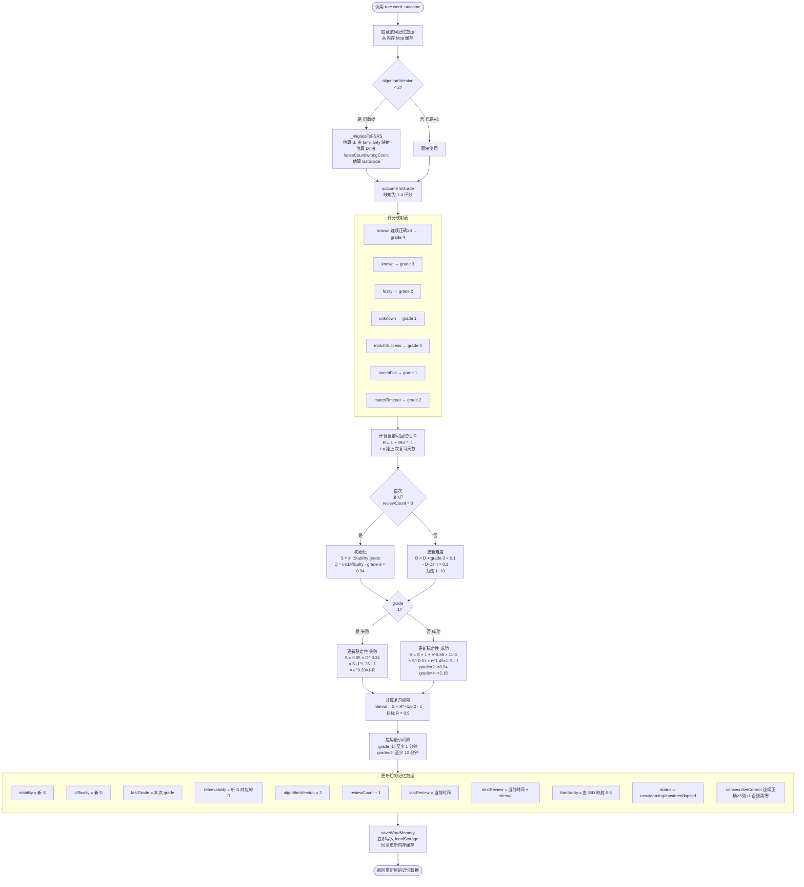
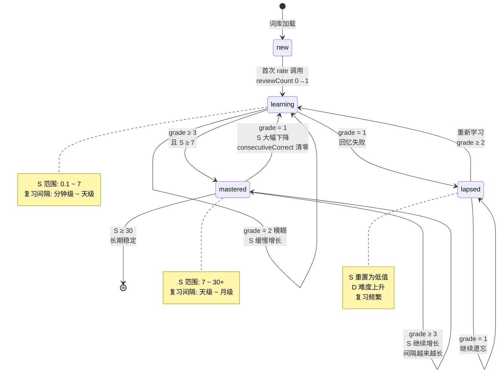
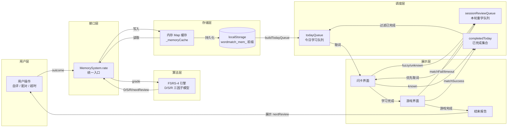
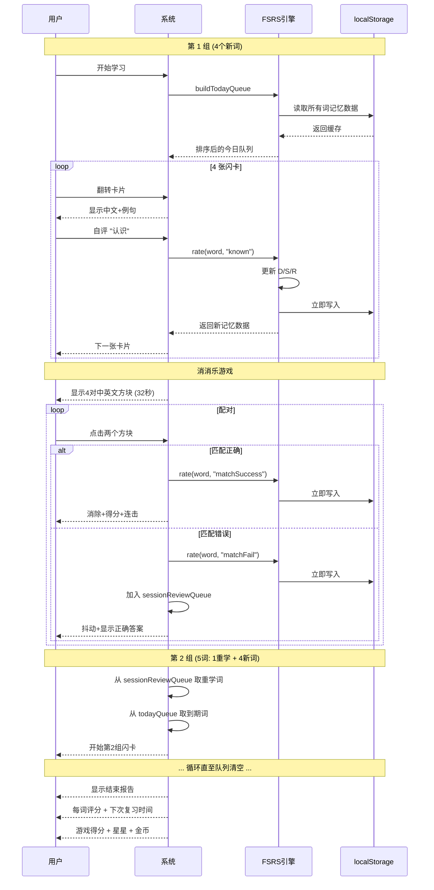
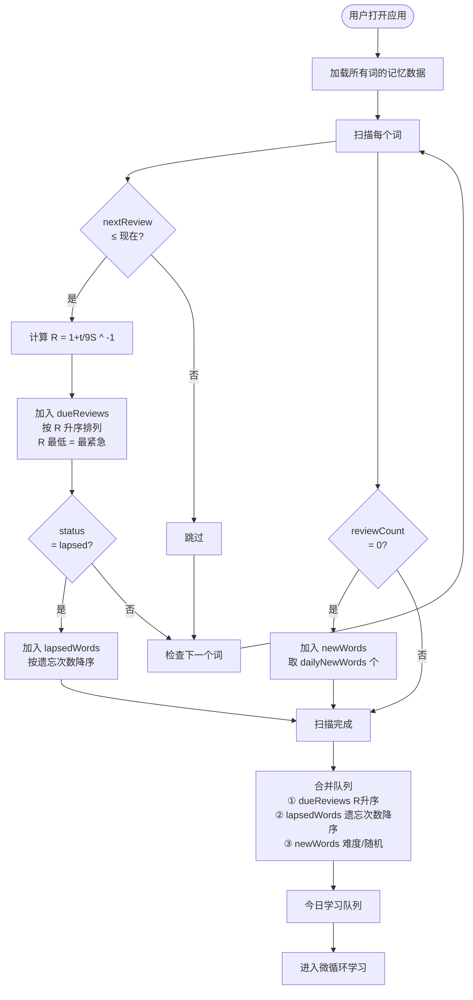

# 闪卡记忆：完整学习流程图

## 一、主流程：用户学习全周期

---

## 二、FSRS 算法内部流程

---

## 三、单词状态机

---

## 四、数据流转图

---

## 五、微循环时序图

---

## 六、复习调度决策图

---

## 七、关键路径总结

| 阶段 | 用户行为 | 系统响应 | FSRS 更新 | 数据写入 |
|------|---------|---------|----------|---------|
| 闪卡-认识 | 点击"认识" | 下一张卡片 | grade 3/4 → S 增长 | 立即写入 |
| 闪卡-模糊 | 点击"模糊" | 下一张卡片 + 加入重学队列 | grade 2 → S 缓增 | 立即写入 |
| 闪卡-不会 | 点击"不认识" | 显示记忆法 + 加入重学队列 | grade 1 → S 重置 | 立即写入 |
| 游戏-配对成功 | 点击匹配对 | 消除+得分+连击 | grade 3 → S 增长 | 立即写入 |
| 游戏-配对失败 | 点击错误对 | 抖动+显示答案+加入重学 | grade 1 → S 重置 | 立即写入 |
| 游戏-超时 | 时间到 | 未配对词自动评分 | grade 2 → S 缓降 | 立即写入 |
| 组间切换 | 自动 | 取下一组(含重学词) | — | — |
| 全部完成 | 自动 | 显示结束报告 | — | 批量发放金币 |
| 到期复习 | 打开应用 | 生成复习队列 | R < 0.9 的词优先 | — |
