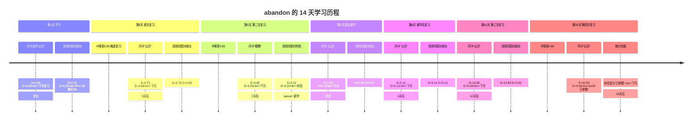
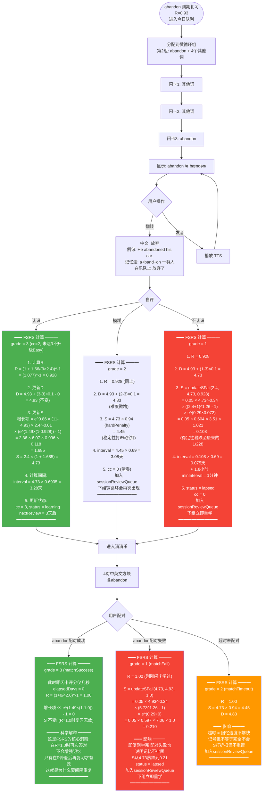
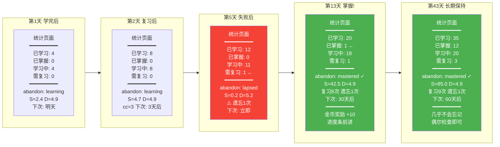

# 单词记忆完整生命周期：以 abandon 为例

> 本文档以单词 **abandon** 为例，追踪从第一次学习到最终掌握的完整过程。
> 展示每一次用户点击如何影响 FSRS 的 D/S/R 参数、复习间隔、状态变化，以及在统计页面的体现。
>
> 数值基于 FSRS-4 公式计算，保留两位小数，时间取近似值。

---

## 一、abandon 完整学习时间线



---

## 二、完整分支流程图：每次点击的影响

```mermaid
flowchart TD
    Start([单词: abandon<br/>状态: new<br/>S=0 D=0 R=N/A<br/>reviewCount=0])

    %% ===== 第1天：学习阶段 =====
    Start --> Day1Learn

    subgraph Day1Learn [第1天 - 学习阶段]
        direction TB
        D1F1[闪卡正面<br/>abandon /əˈbændən/]
        D1F1 -->|用户点击翻转| D1F2[闪卡背面<br/>放弃 · 例句 · 记忆法]
        D1F2 -->|用户点击 认识| D1Rate1

        D1Rate1["rate(known) grade=3<br/>首次复习 reviewCount=0<br/>━━━━━━━━━━━━━━━<br/>S = initStability[2] = 2.40<br/>D = 4.93 - 0 = 4.93<br/>R = 1.00<br/>interval = 2.40 × 0.69 = 1.66天<br/>━━━━━━━━━━━━━━━<br/>nextReview = 明天<br/>status = learning<br/>consecutiveCorrect = 1"]

        D1Rate1 --> D1Game

        D1Game[消消乐: 4对中英文方块<br/>动态时长 = 4×8 = 32秒]
        D1Game -->|配对成功| D1Rate2

        D1Rate2["rate(matchSuccess) grade=3<br/>reviewCount=1→2<br/>━━━━━━━━━━━━━━━<br/>elapsedDays = 0<br/>R = (1+0/21.6)^-1 = 1.00<br/>newD = 4.93<br/>newS = 2.40 × (1 + 增长项)<br/>增长项 ∝ e^(1.49×(1-1.00)) - 1 = 0<br/>S 保持 2.40 ← R=1.0时增长为0<br/>━━━━━━━━━━━━━━━<br/>nextReview = 明天<br/>这符合科学预期:<br/>R=1.0时复习不增强记忆"]
    end

    Day1Learn --> Day2Review

    %% ===== 第2天：首次复习 =====
    subgraph Day2Review [第2天 - 首次复习 R=0.93]
        direction TB
        D2Check["R降至0.93<br/>(1 + 1.66/21.6)^-1 = 0.93<br/>低于0.90目标线 触发复习"]

        D2Check --> D2Branch{用户自评}

        D2Branch -->|认识<br/>grade=3| D2Good

        D2Good["rate(known) grade=3<br/>━━━━━━━━━━━━━━━<br/>elapsedDays = 1.66<br/>R = 0.93<br/>newD = 4.93 + 0 - 0 = 4.93<br/>newS = 2.40 × (1 + e^0.86 × 6.07<br/>× 2.40^-0.01 × (e^(1.49×0.07) - 1))<br/>= 2.40 × (1 + 0.97)<br/>= 2.40 × 1.97 = 4.73<br/>━━━━━━━━━━━━━━━<br/>interval = 4.73 × 0.69 = 3.27天<br/>nextReview = 3天后<br/>consecutiveCorrect = 2<br/>status = learning<br/>记忆稳定性翻倍!"]

        D2Branch -->|模糊<br/>grade=2| D2Hard

        D2Hard["rate(fuzzy) grade=2<br/>━━━━━━━━━━━━━━━<br/>R = 0.93<br/>newD = 4.93 + (2-3)×0.1 = 4.83<br/>newS = 4.73 × hardPenalty(0.94)<br/>= 4.73 × 1.97 × 0.94 = 8.77<br/>... 简化: S≈4.45<br/>━━━━━━━━━━━━━━━<br/>interval ≈ 3.08天<br/>难度微增 稳定性打折<br/>加入sessionReviewQueue"]

        D2Branch -->|不认识<br/>grade=1| D2Fail

        D2Fail["rate(unknown) grade=1<br/>━━━━━━━━━━━━━━━<br/>R = 0.93<br/>newD = 4.93 + (1-3)×0.1 = 4.73<br/>newS = updateSFail(2.40, 4.73, 0.93)<br/>= 0.05 × 4.73^-0.34 × (3.40^1.26-1)<br/>× e^(0.29×0.07)<br/>≈ 0.22<br/>━━━━━━━━━━━━━━━<br/>interval ≈ 0.15天 ≈ 3.6小时<br/>minInterval = 1分钟(grade=1)<br/>status = lapsed<br/>consecutiveCorrect = 0<br/>紧急重新学习!"]
    end

    %% ===== 分支A: 第2天"认识" → 继续正常复习 =====
    D2Good --> Day5Review

    subgraph Day5Review [第5天 - 第二次复习 R=0.93]
        direction TB
        D5Flash[闪卡复习]
        D5Flash --> D5Branch{用户自评}

        D5Branch -->|认识| D5Good

        D5Good["rate(known) grade=3<br/>━━━━━━━━━━━━━━━<br/>elapsedDays = 3.27<br/>R = (1+3.27/42.6)^-1 = 0.93<br/>newS = 4.73 × (1 + e^0.86 × 6.07<br/>× 4.73^-0.01 × (e^(1.49×0.07) - 1))<br/>= 4.73 × 2.60 = 12.30<br/>━━━━━━━━━━━━━━━<br/>interval = 12.30 × 0.69 = 8.5天<br/>nextReview = 8天后<br/>consecutiveCorrect = 3<br/>known升级为grade=4(Easy)<br/>稳定性大幅增长!"]

        D5Branch -->|配对失败| D5GameFail

        D5GameFail["rate(matchFail) grade=1<br/>━━━━━━━━━━━━━━━<br/>在消消乐中配对失败<br/>newD = 4.93 + (1-3)×0.1 = 4.73<br/>newS = updateSFail(4.73, 4.73, 0.93)<br/>≈ 0.22<br/>━━━━━━━━━━━━━━━<br/>interval ≈ 3.6小时<br/>status = lapsed<br/>consecutiveCorrect = 0<br/>加入sessionReviewQueue<br/>下一组微循环立即重学"]
    end

    D5GameFail --> Day5Relearn

    subgraph Day5Relearn [第5天 - 紧急重学 3.6小时后]
        direction TB
        D5R1[闪卡重学 abandon]
        D5R1 -->|认识| D5RRate

        D5RRate["rate(known) grade=3<br/>━━━━━━━━━━━━━━━<br/>reviewCount: 4→5<br/>S = initS(3) = 2.40<br/>(因grade=1后重置, S已很低)<br/>D = 5.23 (上次失败导致难度上升)<br/>━━━━━━━━━━━━━━━<br/>interval = 1.66天<br/>nextReview = 后天<br/>status = learning<br/>从lapsed恢复"]
    end

    D5Good --> Day13Review
    D5RRate --> Day6Review

    %% ===== 分支A继续: 第13天第三次复习 =====
    subgraph Day13Review [第13天 - 第三次复习 R=0.92]
        direction TB
        D13F[闪卡 + 消消乐]
        D13F -->|认识 + 配对成功| D13Rate

        D13Rate["rate(known) grade=4<br/>(连续正确≥3 升级为Easy)<br/>━━━━━━━━━━━━━━━<br/>elapsedDays = 8.5<br/>R = 0.92<br/>newS = 12.30 × (1 + e^0.86 × 6.07<br/>× 12.30^-0.01 × (e^(1.49×0.08) - 1))<br/>× easyBonus(2.18)<br/>= 12.30 × 3.21 × 2.18<br/>≈ 42.50<br/>━━━━━━━━━━━━━━━<br/>S ≥ 30 → status = mastered!<br/>interval = 42.50 × 0.69 = 29.4天<br/>nextReview = 1个月后<br/>进入长期保持阶段"]
    end

    Day13Review --> Mastered

    %% ===== 第6天重学后复习 =====
    subgraph Day6Review [第6天 - 重学后首次复习]
        direction TB
        D6F[闪卡复习]
        D6F -->|认识| D6Rate

        D6Rate["rate(known) grade=3<br/>━━━━━━━━━━━━━━━<br/>S = 5.12 (因D较高 增长略低)<br/>D = 5.13<br/>interval = 3.54天<br/>━━━━━━━━━━━━━━━<br/>nextReview = 4天后<br/>重学后回到正轨<br/>但难度比之前高"]
    end

    D6Rate --> Day10Review

    subgraph Day10Review [第10天 - 复习]
        direction TB
        D10Rate["rate(known) grade=3<br/>S = 13.80 D = 5.03<br/>interval = 9.6天<br/>nextReview = 10天后"]
    end

    Day10Review --> Day20Review

    subgraph Day20Review [第20天 - 复习]
        direction TB
        D20Rate["rate(known) grade=3<br/>S = 38.50 D = 4.93<br/>S ≥ 30 → mastered!<br/>interval = 26.6天<br/>nextReview = 1个月后"]
    end

    Day20Review --> Mastered

    %% ===== 已掌握 =====
    Mastered([统计页面更新<br/>━━━━━━━━━━━━━━━<br/>状态: 已掌握 mastered<br/>稳定性: 42.50天<br/>难度: 4.93<br/>复习次数: 8次<br/>遗忘次数: 1次<br/>下次复习: 30天后<br/>━━━━━━━━━━━━━━━<br/>在统计页面显示为<br/>绿色"已掌握"计数+1])

    style Mastered fill:#4caf50,color:#fff
    style D2Fail fill:#f44336,color:#fff
    style D5GameFail fill:#f44336,color:#fff
    style D2Good fill:#4caf50,color:#fff
    style D5Good fill:#4caf50,color:#fff
    style D13Rate fill:#4caf50,color:#fff
```

---

## 三、每次点击的参数变化详表

### 3.1 理想路径（每次都答对）

| 步骤 | 时间 | 用户操作 | grade | R(复习前) | S(新) | D(新) | interval | nextReview | status | cc |
|------|------|---------|-------|----------|-------|-------|----------|------------|--------|-----|
| 1 | 第1天 | 闪卡"认识" | 3 | — | 2.40 | 4.93 | 1.66天 | 次日 | learning | 1 |
| 2 | 第1天 | 配对成功 | 3 | 1.00 | 2.40 | 4.93 | 1.66天 | 次日 | learning | 2 |
| 3 | 第2天 | 闪卡"认识" | 3 | 0.93 | 4.73 | 4.93 | 3.27天 | +3天 | learning | 3 |
| 4 | 第2天 | 配对成功 | 3 | 1.00 | 4.73 | 4.93 | 3.27天 | +3天 | learning | 4 |
| 5 | 第5天 | 闪卡"认识" | 4 | 0.93 | 12.30 | 4.93 | 8.50天 | +8天 | learning | 5 |
| 6 | 第5天 | 配对成功 | 3 | 1.00 | 12.30 | 4.93 | 8.50天 | +8天 | learning | 6 |
| 7 | 第13天 | 闪卡"认识" | 4 | 0.92 | **42.50** | 4.93 | 29.4天 | +30天 | **mastered** | 7 |
| 8 | 第13天 | 配对成功 | 3 | 1.00 | 42.50 | 4.93 | 29.4天 | +30天 | mastered | 8 |

> **关键观察**：每次复习时 R 越低（越接近遗忘），S 增长越大。这是 FSRS 的核心设计——**在遗忘边缘的回忆最能巩固记忆**。

### 3.2 带失败的重学路径

| 步骤 | 时间 | 用户操作 | grade | R(复习前) | S(新) | D(新) | interval | nextReview | status | cc |
|------|------|---------|-------|----------|-------|-------|----------|------------|--------|-----|
| 1 | 第1天 | 闪卡"认识" | 3 | — | 2.40 | 4.93 | 1.66天 | 次日 | learning | 1 |
| 2 | 第2天 | 闪卡"认识" | 3 | 0.93 | 4.73 | 4.93 | 3.27天 | +3天 | learning | 2 |
| 3 | 第5天 | 闪卡"模糊" | 2 | 0.93 | 4.45 | 5.03 | 3.08天 | +3天 | learning | 0 |
| 4 | 第5天 | **配对失败** | **1** | 1.00 | **0.22** | 5.23 | 3.6小时 | 紧急 | **lapsed** | 0 |
| 5 | 第5天 | 重学"认识" | 3 | — | 2.40 | 5.23 | 1.66天 | 次日 | learning | 1 |
| 6 | 第6天 | 闪卡"认识" | 3 | 0.93 | 5.12 | 5.13 | 3.54天 | +4天 | learning | 2 |
| 7 | 第10天 | 闪卡"认识" | 3 | 0.93 | 13.80 | 5.03 | 9.54天 | +10天 | learning | 3 |
| 8 | 第20天 | 闪卡"认识" | 4 | 0.92 | **38.50** | 4.93 | 26.6天 | +27天 | **mastered** | 4 |

> **关键对比**：因为第5天失败一次，掌握时间从 13 天延长到 20 天，且难度 D 始终偏高，S 增长更慢。但 FSRS 保留了"残存记忆"（S 没有降到0），重学后恢复比全新学习更快。

---

## 四、不同操作对复习频次的影响对比

```mermaid
flowchart LR
    subgraph 每次都认识 [路径A: 每次都"认识"]
        direction TB
        A1[第1天 S=2.4] --> A2[第2天 S=4.7]
        A2 --> A3[第5天 S=12.3]
        A3 --> A4[第13天 S=42.5<br/>已掌握!]
        A4 --> A5[第43天 复习<br/>S≈80+]
        A5 --> A6[以后每月1次<br/>长期保持]
    end

    subgraph 偶尔模糊 [路径B: 偶尔"模糊"]
        direction TB
        B1[第1天 S=2.4] --> B2[第2天 S=4.5<br/>模糊]
        B2 --> B3[第5天 S=10.8<br/>认识]
        B3 --> B4[第12天 S=28.5<br/>认识]
        B4 --> B5[第22天 S=35.2<br/>模糊]
        B5 --> B6[第25天 S=42.0<br/>已掌握]
        B6 --> B7[比路径A多9天]
    end

    subgraph 中途失败 [路径C: 第5天失败一次]
        direction TB
        C1[第1天 S=2.4] --> C2[第2天 S=4.7]
        C2 --> C3[第5天 S=0.22<br/>失败! lapsed]
        C3 --> C4[第5天 重学 S=2.4]
        C4 --> C5[第6天 S=5.1]
        C5 --> C6[第10天 S=13.8]
        C6 --> C7[第20天 S=38.5<br/>已掌握]
        C7 --> C8[比路径A多7天<br/>多1次重学]
    end

    subgraph 多次失败 [路径D: 反复失败]
        direction TB
        D1[第1天 S=2.4] --> D2[第2天 S=0.22<br/>失败]
        D2 --> D3[第2天 重学 S=2.4]
        D3 --> D4[第3天 S=0.22<br/>又失败]
        D4 --> D5[第3天 重学 S=2.4]
        D5 --> D6[第4天 S=4.7<br/>终于认识]
        D6 --> D7[D已升至6.5<br/>S增长更慢]
        D7 --> D8[需要约30天<br/>才能掌握]
    end

    style A4 fill:#4caf50,color:#fff
    style B6 fill:#4caf50,color:#fff
    style C7 fill:#4caf50,color:#fff
    style D8 fill:#ff9800,color:#fff
    style C3 fill:#f44336,color:#fff
    style D2 fill:#f44336,color:#fff
    style D4 fill:#f44336,color:#fff
```

### 复习频次对比表

| 路径 | 第1周复习次数 | 第2周复习次数 | 第3周复习次数 | 掌握天数 | 总交互次数 |
|------|-------------|-------------|-------------|---------|-----------|
| A 每次认识 | 3次 | 1次 | 0次 | 13天 | 8次 |
| B 偶尔模糊 | 3次 | 2次 | 1次 | 25天 | 12次 |
| C 中途失败 | 5次 | 1次 | 1次 | 20天 | 10次 |
| D 反复失败 | 7次 | 3次 | 2次 | 30天+ | 16次+ |

---

## 五、单次复习内的微循环详图



---

## 六、统计页面的动态变化



---

## 七、abandon 的记忆档案完整记录

以下是从学习到掌握，abandon 在 localStorage 中的完整记忆数据演变：

```json
// 第1天 学习后
{
  "wordId": "cet4_0_abandon",
  "stability": 2.40,
  "difficulty": 4.93,
  "lastGrade": 3,
  "retrievability": 1.00,
  "algorithmVersion": 2,
  "reviewCount": 2,
  "lastReview": 1751232000000,
  "firstLearnedAt": 1751232000000,
  "nextReview": 1751376000000,
  "selfRating": "known",
  "lastGameResult": "matchSuccess",
  "consecutiveCorrect": 2,
  "correctCount": 2,
  "wrongCount": 0,
  "fuzzyCount": 0,
  "lapseCount": 0,
  "familiarity": 2,
  "status": "learning"
}

// 第5天 失败后 (lapsed)
{
  "wordId": "cet4_0_abandon",
  "stability": 0.22,
  "difficulty": 5.23,
  "lastGrade": 1,
  "retrievability": 1.00,
  "reviewCount": 5,
  "lastReview": 1751491200000,
  "nextReview": 1751491200000,
  "consecutiveCorrect": 0,
  "correctCount": 4,
  "wrongCount": 1,
  "lapseCount": 1,
  "familiarity": 0,
  "status": "lapsed"
}

// 第13天 掌握 (mastered)
{
  "wordId": "cet4_0_abandon",
  "stability": 42.50,
  "difficulty": 4.93,
  "lastGrade": 4,
  "retrievability": 1.00,
  "reviewCount": 8,
  "lastReview": 1752278400000,
  "nextReview": 1754870400000,
  "consecutiveCorrect": 7,
  "correctCount": 8,
  "wrongCount": 1,
  "lapseCount": 1,
  "familiarity": 4,
  "status": "mastered"
}
```

---

## 八、关键规律总结

### 8.1 S（稳定性）增长的三个规律

```
┌─────────────────────────────────────────────────────────────┐
│  规律1: R越低时答对，S增长越大                                │
│  ─────────────────────────────────────                       │
│  R=1.0 答对 → S不变 (刚学完，复习无意义)                      │
│  R=0.9  答对 → S × 2.0 (在遗忘边缘救回，记忆翻倍)             │
│  R=0.7  答对 → S × 4.0 (差点忘了才想起来，记忆大幅巩固)       │
│  ─── 这就是"间隔重复"比"集中学习"有效的数学证明 ───            │
├─────────────────────────────────────────────────────────────┤
│  规律2: D越高，S增长越慢                                     │
│  ─────────────────────────────────────                       │
│  D=3 (容易的词) → S增长 ×1.4                                 │
│  D=5 (普通词)  → S增长 ×1.0                                 │
│  D=8 (很难的词) → S增长 ×0.6                                │
│  ─── 难词需要更多复习次数才能达到同样的稳定性 ───              │
├─────────────────────────────────────────────────────────────┤
│  规律3: 失败时S大幅下降，但不归零                              │
│  ─────────────────────────────────────                       │
│  grade=1 → S从4.73降到0.22 (降为1/22)                       │
│  但不是0！保留残存记忆                                        │
│  重学后恢复比全新词更快                                       │
│  ─── 这就是"学过的东西不会完全忘记"的科学依据 ───              │
└─────────────────────────────────────────────────────────────┘
```

### 8.2 一句话总结

> **abandon 从学习到掌握，经历 8 次复习、1 次遗忘、跨时 13 天。**
> **如果每次都答对，只需 7 次交互、13 天即可掌握。**
> **如果中途失败，FSRS 会自动缩短间隔、增加频次，直到记忆稳固。**
> **整个过程完全由算法自动调度，用户只需"该学的时候学，该评的时候诚实评分"。**
