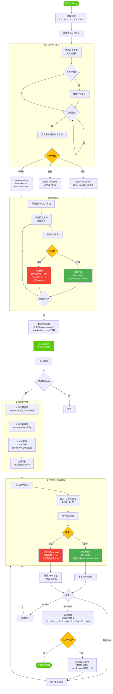

# 闪卡记忆：学习复习机制流程图

```mermaid
flowchart TD
    START([用户打开App]) --> SELECT[选择词库<br/>CET4/CET6/TOEFL/GRE]
    SELECT --> FETCH[系统取出N个新词]
    FETCH --> LEARN_PHASE

    subgraph LEARN_PHASE [学习阶段：闪卡]
        SHOW_CARD[显示闪卡正面<br/>英文+音标] --> CLICK_PRON{点击发音?}
        CLICK_PRON -->|是| PLAY_TTS[播放TTS读音]
        PLAY_TTS --> CLICK_FLIP
        CLICK_PRON -->|否| CLICK_FLIP{点击翻转?}
        CLICK_FLIP -->|是| FLIP[显示中文+例句+记忆法]
        FLIP --> RATE
        CLICK_FLIP -->|否| CLICK_FLIP
    end

    RATE{用户评分} -->|认识| RATE_KNOWN[status=learning<br/>consecutiveCorrect=1]
    RATE -->|模糊| RATE_FUZZY[status=learning<br/>isWeak=true]
    RATE -->|不认识| RATE_UNKNOWN[status=learning<br/>isWeak=true<br/>matchErrors+1]

    RATE_KNOWN --> GAME_PHASE
    RATE_FUZZY --> GAME_PHASE
    RATE_UNKNOWN --> GAME_PHASE

    subgraph GAME_PHASE [消消乐阶段]
        SHOW_BLOCKS[同时显示中英文方块] --> CLICK_EN[点击英文方块<br/>高亮显示]
        CLICK_EN --> CLICK_CN[点击中文方块]
        CLICK_CN --> MATCH{匹配?}
        MATCH -->|正确| MATCH_OK[消除方块<br/>得分+连击<br/>consecutiveCorrect+1]
        MATCH -->|错误| MATCH_FAIL[抖动反馈<br/>显示正确释义2秒<br/>matchErrors+1<br/>isWeak=true]
        MATCH_OK --> ALL_DONE{全部消除?}
        MATCH_FAIL --> ALL_DONE
        ALL_DONE -->|否| CLICK_EN
    end

    ALL_DONE -->|是| LEARN_END[本组学习完成<br/>所有词status=learning<br/>nextReview=now+5分钟]
    LEARN_END --> END_SCREEN[显示结束页<br/>发放金币奖励]
    END_SCREEN --> BACK_HOME[返回首页]

    BACK_HOME --> NEXT_DAY{次日打开App}
    NEXT_DAY -->|是| GEN_QUEUE[生成复习队列]
    NEXT_DAY -->|否| WAIT[等待]

    subgraph GEN_QUEUE [复习队列生成]
        Q1[1.筛选薄弱词<br/>isWeak=true且非mastered] --> Q2[2.筛选到期词<br/>nextReview<=今天]
        Q2 --> Q3[3.补充新词<br/>status=new<br/>受dailyNewLimit限制]
        Q3 --> Q_MERGE[合并队列<br/>薄弱>到期>新词]
    end

    Q_MERGE --> REVIEW_PHASE

    subgraph REVIEW_PHASE [复习阶段：快速匹配]
        SHOW_Q[显示英文单词] --> SHOW_OPTS[显示4个中文选项<br/>1正确+3干扰]
        SHOW_OPTS --> CLICK_OPT[用户点击选项]
        CLICK_OPT --> ANSWER{回答?}
        ANSWER -->|正确| REV_OK[FSRS推进<br/>延长间隔<br/>可能升级familiar/mastered]
        ANSWER -->|错误| REV_FAIL[状态回退learning<br/>间隔重置5分钟<br/>显示例句+记忆法]
    end

    REV_OK --> UPDATE_FSRS[更新D/S/R参数]
    REV_FAIL --> UPDATE_FAIL[更新D/S/R参数<br/>D增加 S降低]
    UPDATE_FSRS --> CHECK_MASTER{状态?}
    UPDATE_FAIL --> CHECK_MASTER

    CHECK_MASTER -->|mastered| LONG_TERM[长期循环<br/>间隔逐步拉长<br/>5m→30m→1d→2d→4d→7d→15d→30d→60d]
    CHECK_MASTER -->|familiar| REVIEW_NEXT[继续复习]
    CHECK_MASTER -->|learning| RE_LEARN[稍后重新出现]

    LONG_TERM --> FORGET{日后答错?}
    FORGET -->|是| RESET[降级回learning<br/>D增加 S降低<br/>nextReview重置5分钟]
    FORGET -->|否| STABLE([长期稳定掌握])

    RESET --> RE_LEARN
    RE_LEARN --> REVIEW_PHASE
    REVIEW_NEXT --> REVIEW_PHASE

    style START fill:#58cc02,color:#fff
    style END_SCREEN fill:#58cc02,color:#fff
    style STABLE fill:#58cc02,color:#fff
    style RATE fill:#ffc107,color:#000
    style MATCH fill:#ffc107,color:#000
    style ANSWER fill:#ffc107,color:#000
    style FORGET fill:#ffc107,color:#000
    style MATCH_OK fill:#4caf50,color:#fff
    style MATCH_FAIL fill:#f44336,color:#fff
    style REV_OK fill:#4caf50,color:#fff
    style REV_FAIL fill:#f44336,color:#fff
```
