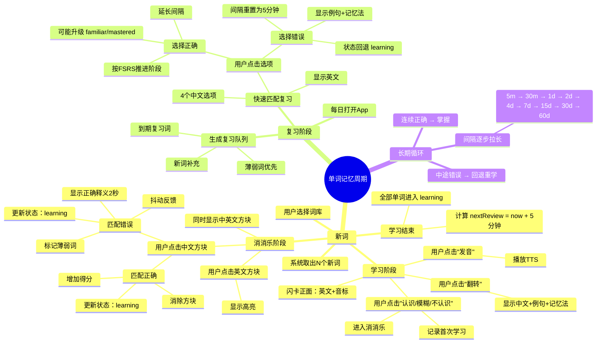
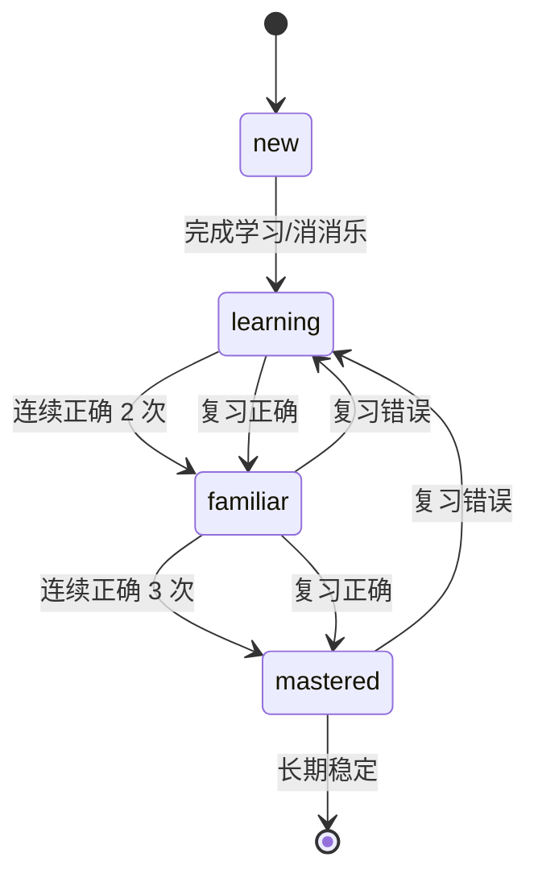

# 闪卡记忆：学习+复习机制设计（FSRS 算法）

## 一、核心思维导图



## 二、单词状态机



## 三、用户点击结果完整表

### 3.1 学习阶段（闪卡）

| 用户操作 | 前端反馈 | 背后机制 | 数据更新 |
|---------|---------|---------|---------|
| 点击"发音" | 播放单词读音 | 调用 `speechSynthesis` | 无 |
| 点击"翻转" | 显示中文+例句+记忆法 | 切换卡片状态 | 无 |
| 点击"认识" | 进入下一张卡片 | 标记该词已初步认识 | `status: learning`, `consecutiveCorrect: 1` |
| 点击"模糊" | 进入下一张，稍后重学 | 该词需要加强 | `status: learning`, `isWeak: true` |
| 点击"不认识" | 显示记忆法，停留后进入下一张 | 该词是薄弱词 | `status: learning`, `isWeak: true`, `matchErrors: +1` |

### 3.2 消消乐阶段

| 用户操作 | 前端反馈 | 背后机制 | 数据更新 |
|---------|---------|---------|---------|
| 点击英文方块 | 高亮显示 | 记录当前选择 | 临时状态 |
| 点击中文方块 | 判断是否匹配 | 对比两个方块 | 临时状态 |
| 匹配正确 | 消除 + 得分 + 连击 | 强化记忆 | `totalReviews: +1`, `totalCorrect: +1`, `consecutiveCorrect: +1` |
| 匹配错误 | 抖动 + 显示正确释义 2秒 | 错误纠正 | `matchErrors: +1`, `isWeak: true` |
| 消除全部 | 进入结束页 | 本组学习完成 | 所有词进入 `learning`, 计算 `nextReview` |

### 3.3 复习阶段（快速匹配）

| 用户操作 | 前端反馈 | 背后机制 | 数据更新 |
|---------|---------|---------|---------|
| 点击"认识" | 进入下一题 | 复习正确 | 按 FSRS 推进，更新 `D`, `S`, `R`，延长 `nextReview` |
| 点击"不认识" | 显示例句+记忆法 | 复习失败 | 状态回退 `learning`, `stage` 重置, `nextReview = now + 5m` |
| 点击"发音" | 播放读音 | 辅助回忆 | 无 |
| 点击"查看详情" | 弹出完整例句+记忆法 | 学习辅助 | 无 |

## 四、FSRS 算法核心公式

### 4.1 三个核心参数

- **D (Difficulty)**: 难度，范围 1-10，新词默认 5
- **S (Stability)**: 稳定性，表示记忆保持的天数，新词默认 0.5
- **R (Retrievability)**: 可回忆性，当前时刻记住的概率

### 4.2 可回忆性公式

```
R = 2.5^(-days_since_review / S)
```

- 刚复习完：R ≈ 1
- 随着时间流逝：R 逐渐下降
- 当 R < 0.9 时安排复习

### 4.3 评分后的更新

FSRS 标准评分：

| 评分 | 含义 | 对记忆的影响 |
|------|------|-------------|
| 1 - Again | 完全想不起来 | 难度增加，稳定性降低 |
| 2 - Hard | 勉强想起 | 难度微增，稳定性增长少 |
| 3 - Good | 正常想起 | 难度不变，稳定性正常增长 |
| 4 - Easy | 非常容易 | 难度降低，稳定性大幅增长 |

对于"快速匹配"场景，映射为：

| 用户操作 | FSRS 评分 | 说明 |
|---------|----------|------|
| 消消乐匹配错误 / 复习选择错误 | 1 (Again) | 完全没印象 |
| 消消乐匹配正确但犹豫 | 2 (Hard) | 勉强认出 |
| 消消乐匹配正确且快速 | 3 (Good) | 正常识别 |
| 复习选择正确且快速 | 4 (Easy) | 很熟悉 |

### 4.4 简化版 FSRS 实现

```javascript
const FSRS = {
  // 默认参数
  defaultD: 5.0,
  defaultS: 0.5,
  requestRetention: 0.9,  // 目标保持率 90%

  // 根据评分更新 Difficulty
  updateDifficulty(D, rating) {
    const weight = 0.5; // 难度调整系数
    const delta = {
      1: +1.0,  // Again: 变难
      2: +0.3,  // Hard: 略难
      3: 0.0,   // Good: 不变
      4: -0.5   // Easy: 变易
    }[rating];
    return Math.max(1, Math.min(10, D + delta));
  },

  // 根据评分更新 Stability
  updateStability(S, D, rating) {
    const base = {
      1: 0.5,   // Again: 稳定性大幅下降
      2: 1.0,   // Hard: 小幅增长
      3: 2.5,   // Good: 正常增长
      4: 4.0    // Easy: 大幅增长
    }[rating];
    
    // 难度修正：难度越高，增长越慢
    const difficultyFactor = 1 - (D - 5) * 0.05;
    return Math.max(0.1, S * base * difficultyFactor);
  },

  // 计算下次复习间隔
  nextInterval(S, targetR = 0.9) {
    // 当 R 降到 targetR 时复习
    // R = 2.5^(-t/S) = targetR
    // t = S * log(targetR) / log(2.5)
    return S * Math.log(targetR) / Math.log(2.5);
  },

  // 计算当前可回忆性
  retrievability(S, elapsedDays) {
    return Math.pow(2.5, -elapsedDays / S);
  }
};
```

## 五、实际运行示例

### 单词：`abandon`

#### 第 1 步：学习阶段
- 用户看闪卡：abandon / əˈbændən / 放弃
- 用户点"认识"
- 状态：
  ```js
  {
    word: "abandon",
    status: "learning",
    D: 5.0,
    S: 0.5,
    consecutiveCorrect: 1,
    lastReviewed: now,
    nextReview: now + 5 minutes
  }
  ```

#### 第 2 步：5 分钟后首次复习
- 复习形式：显示 abandon，4 选 1
- 用户选择正确 → 评分 3 (Good)
- 更新：
  ```js
  D = 5.0 + 0 = 5.0
  S = 0.5 * 2.5 * 1.0 = 1.25 天
  nextReview = now + 1.25 天 ≈ 30 小时
  consecutiveCorrect = 2
  status = "familiar"
  ```

#### 第 3 步：1.25 天后复习
- 用户选择正确 → 评分 3 (Good)
- 更新：
  ```js
  S = 1.25 * 2.5 = 3.125 天
  nextReview = now + 3.125 天
  consecutiveCorrect = 3
  status = "mastered"
  ```

#### 第 4 步：3.125 天后复习
- 用户选择错误 → 评分 1 (Again)
- 更新：
  ```js
  D = 5.0 + 1.0 = 6.0
  S = 0.5 * 0.5 * (1 - 0.05) = 0.2375 天
  status = "learning"
  consecutiveCorrect = 0
  nextReview = now + 5 分钟
  ```
- 5 分钟后重新学习

#### 第 5 步：重新学习后
- 再次进入 learning 循环
- 但由于 D 变高了（6.0），之后每次复习正确的 S 增长会变慢
- 难度大的词需要更多复习次数

## 六、每日复习队列生成算法

```javascript
function generateReviewQueue(words, today) {
  // 1. 到期复习词
  const due = words.filter(w => w.nextReview <= today);
  
  // 2. 薄弱词（即使没到期也优先）
  const weak = words.filter(w => w.isWeak && w.status !== 'mastered');
  
  // 3. 新词
  const newWords = words.filter(w => w.status === 'new').slice(0, dailyNewLimit);
  
  // 排序：薄弱 > 到期 > 新词
  return [...weak, ...due, ...newWords];
}
```

## 七、关键设计原则

1. **学习阶段只建立印象**：闪卡+消消乐+例句+记忆法
2. **复习阶段用快速匹配**：符合"识别型记忆"定位
3. **FSRS 负责长期调度**：每个单词根据实际表现动态调整复习间隔
4. **错误不会惩罚用户**：答错只是回到 learning，重新学习
5. **薄弱词永远优先**：匹配错误多的词会反复出现

## 八、对比 SM-2 为什么选择 FSRS

| 特性 | SM-2 | FSRS |
|------|------|------|
| 参数 | EF + interval | D + S + R |
| 是否考虑时间 | 只考虑日期 | 精确到时间 |
| 难度调整 | 简单 | 连续动态调整 |
| 适合快速匹配 | 一般 | 更好 |
| 现代软件支持 | Anki 旧版 | Anki 新版、开源 |

**推荐用 FSRS**，因为它更贴合"快速匹配 + 遗忘曲线"的模型。

