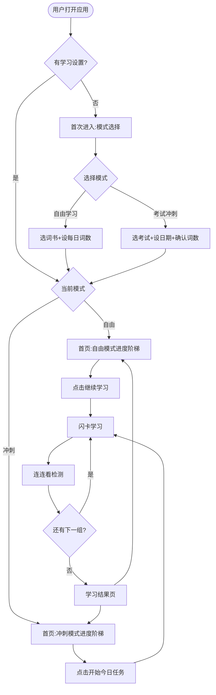

# 闪卡记忆 · 学习系统策划文档

> 版本:V2.0
> 日期:2026-07-25
> 基于:闪卡记忆.html(FSRS-4 算法,多词库)
> 变更:V1.0「角色系统」→ V2.0「双模式学习系统」

---

## 文档总览

本文档为「闪卡记忆」应用的**学习系统**完整策划方案,核心变更为:

1. **双模式设计**:自由学习 + 考试冲刺,用户自选
2. **进度阶梯首页**:词库互通可视化,显示跨词库贡献度
3. **基于实证的学习策略**:3 阶段递进 + 真题词频分层取词
4. **考后留存设计**:破解 Arrival Fallacy,维持长期动机
5. **完整设置页**:首次设置后可在设置中修改所有参数

| 章节 | 交付物 |
|------|--------|
| 第一章 | 需求规格说明书(双模式) |
| 第二章 | 学习策略设计(理论依据 + 3 阶段 + 时间分层) |
| 第三章 | 界面设计(首页 + 计划页 + 学习页 + 首次进入流程) |
| 第四章 | 设置页设计 |
| 第五章 | 考后留存与动机延续设计 |
| 第六章 | 数据库设计变更说明 |
| 第七章 | 开发实施计划与里程碑 |

---

## 第一章 需求规格说明书

### 1.1 功能概述

#### 1.1.1 功能定义

在现有「选词库 → 顺序学习」的基础上,新增**双模式学习系统**:用户首次进入时选择学习方式(自由学习 or 考试冲刺),系统按用户选择驱动每日学习任务。两种模式共享 FSRS 记忆系统,切换不丢失进度。

#### 1.1.2 两种学习模式

| 维度 | 模式 A:自由学习 | 模式 B:考试冲刺 |
|------|------------------|------------------|
| **适用人群** | 无考试压力、长期学习者 | 有明确考试日期的用户 |
| **核心驱动** | 兴趣 + 习惯 | 倒计时 + 目标 |
| **首次设置** | 选词书 → 设每日词数 | 选考试 → 设考试日期 |
| **每日词数** | 用户自定(10/20/30/50) | 系统按剩余天数算 |
| **学什么词** | 按词书顺序 | 按真题词频优先级 |
| **进度展示** | 词书进度条 | 倒计时 + 关卡地图 |
| **结束条件** | 学完整本词书 | 考试日到期 |
| **FSRS 复习** | 共享 | 共享 |

**核心设计原则**:
- **无诊断**:首次进入不进行词汇量诊断(测不准,反而误导)
- **用户自主**:让用户自己选择学习方式和节奏
- **记忆共享**:两种模式共享 FSRS 记忆数据,切换不丢失
- **进度互通**:无论哪个模式,进度阶梯显示所有词库的进度

#### 1.1.3 核心价值

- **尊重用户**:不强制诊断,让用户自主选择学习方式
- **进度互通**:背四级词时,六级/考研进度同步推进(基于真实词库重叠率)
- **时间感知**:冲刺模式根据倒计时动态调整每日学习量
- **长期留存**:考后过渡设计,破解"考完即流失"

### 1.2 功能边界

#### 1.2.1 包含范围

- 2 种学习模式:自由学习、考试冲刺
- 首次进入流程:模式选择 → 配置 → 开始
- 进度阶梯首页:多词库进度互通展示
- 计划详情页:游戏关卡式学习地图
- 完整设置页:学习设置、提醒、显示、数据管理
- 考后留存设计:过渡期引导、下一目标预埋
- 支持考试类型:四级、六级、考研、雅思、托福

#### 1.2.2 不包含范围(明确排除)

| 排除项 | 原因 |
|--------|------|
| 词汇量诊断功能 | 测不准,反而误导用户(20 词抽样误差过大) |
| 听音辨词/填空/选择题模式 | 需求限制:仅保留闪卡 + 连连看 |
| 考试结果预测/保过承诺 | 合规风险,仅提供学习辅助 |
| 社交/排行榜 | 非本模块范围(P2 可选) |
| AI 对话教学 | 非本模块范围 |

### 1.3 用户故事

```
US-01  作为一名新用户,我希望在首次进入时选择学习方式,
       以便按自己的节奏学习(自由)或冲刺备考(冲刺)

US-02  作为一名四级考生,我希望设置考试倒计时,
       以便系统根据剩余天数自动安排每日学习量

US-03  作为一名用户,我希望在首页看到所有词库的进度,
       以便了解背四级词对六级/考研的贡献

US-04  作为一名用户,我希望切换核心/全部词汇视图,
       以便聚焦核心词或查看全量进度

US-05  作为一名用户,我希望在设置中修改学习参数,
       以便调整每日词数、考试日期等

US-06  作为一名用户,我希望切换学习模式时进度不丢失,
       以便自由切换自由学习和考试冲刺

US-07  作为一名考完试的用户,我希望有下一步引导,
       以便维持学习动机不流失

US-08  作为一名用户,我希望看到游戏关卡式学习地图,
       以便直观感受学习进度和成就感
```

### 1.4 功能需求清单

#### FR-01 首次进入流程

| 编号 | 需求 | 优先级 |
|------|------|--------|
| FR-01-01 | 首次进入展示模式选择页(自由学习 / 考试冲刺) | P0 |
| FR-01-02 | 自由模式:选词书 + 设每日词数 | P0 |
| FR-01-03 | 冲刺模式:选考试类型 + 设考试日期 | P0 |
| FR-01-04 | 冲刺模式:系统计算每日词数,用户可调整 | P0 |
| FR-01-05 | 老用户(有学习数据)跳过词书选择 | P1 |

#### FR-02 进度阶梯首页

| 编号 | 需求 | 优先级 |
|------|------|--------|
| FR-02-01 | 显示所有词库的进度条 | P0 |
| FR-02-02 | 核心/全部词汇视图切换 | P0 |
| FR-02-03 | 显示跨词库贡献度(如"六级已包含 82%") | P0 |
| FR-02-04 | 冲刺模式显示倒计时和当前天数 | P0 |
| FR-02-05 | 底部固定"开始今日任务"按钮 | P0 |
| FR-02-06 | 显示累计学习天数和总掌握词数 | P1 |

#### FR-03 计划详情页(冲刺模式)

| 编号 | 需求 | 优先级 |
|------|------|--------|
| FR-03-01 | 游戏关卡式学习地图(日历式) | P0 |
| FR-03-02 | 显示每天状态:已完成/进行中/未解锁 | P0 |
| FR-03-03 | 今日任务详情:新词数、复习数、预计时间 | P0 |
| FR-03-04 | 解锁机制:完成前一天才能解锁下一天 | P1 |
| FR-03-05 | 显示考试日期和剩余天数 | P0 |

#### FR-04 学习模式

| 编号 | 需求 | 优先级 |
|------|------|--------|
| FR-04-01 | 闪卡记忆:单词 + 音标 + 释义 + 例句 | P0 |
| FR-04-02 | 闪卡记忆:点击翻转,「认识/模糊/不认识」三按钮 | P0 |
| FR-04-03 | 连连看:单词与释义配对消除 | P0 |
| FR-04-04 | 学习结果反馈给 FSRS 算法更新记忆状态 | P0 |
| FR-04-05 | 微循环:闪卡学新词 → 连连看检测 → 下一组 | P0 |

#### FR-05 模式切换

| 编号 | 需求 | 优先级 |
|------|------|--------|
| FR-05-01 | 用户可在设置中切换学习模式 | P0 |
| FR-05-02 | 切换时 FSRS 记忆数据保留 | P0 |
| FR-05-03 | 切换时进度阶梯继续显示 | P0 |
| FR-05-04 | 冲刺→自由:冲刺计划暂停(可恢复) | P1 |
| FR-05-05 | 自由→冲刺:选择新考试,已学词自动计入 | P0 |

#### FR-06 设置页

| 编号 | 需求 | 优先级 |
|------|------|--------|
| FR-06-01 | 学习模式切换 | P0 |
| FR-06-02 | 冲刺计划管理(修改日期、调整词数、重新生成) | P0 |
| FR-06-03 | 自由学习配置(切换词书、调整每日词数) | P0 |
| FR-06-04 | 提醒设置(每日提醒、复习提醒、考试倒计时) | P1 |
| FR-06-05 | 显示设置(进度阶梯默认视图、发音、主题) | P2 |
| FR-06-06 | 数据管理(统计、导出、重置) | P1 |

#### FR-07 考后留存

| 编号 | 需求 | 优先级 |
|------|------|--------|
| FR-07-01 | 考完当天:庆祝动画 + 徽章 + 成就展示 | P0 |
| FR-07-02 | 考后第 3 天:词汇留存率报告 + 巩固计划引导 | P1 |
| FR-07-03 | 考后第 7 天:下一目标推荐(六级/考研等) | P1 |
| FR-07-04 | 考前 3 天:预埋"下一步是什么?" | P1 |

### 1.5 非功能需求

| 编号 | 需求 |
|------|------|
| NFR-01 | 计划生成时间 < 500ms |
| NFR-02 | 模式切换响应时间 < 200ms |
| NFR-03 | localStorage 新增存储 < 50KB/计划 |
| NFR-04 | 移动端适配(主要使用场景为手机浏览器) |
| NFR-05 | 兼容 file:// 协议离线使用 |
| NFR-06 | 进度阶梯计算 < 100ms(预计算 + 缓存) |

---

## 第二章 学习策略设计

### 2.1 设计依据

#### 2.1.1 词频覆盖理论(Paul Nation)

词频覆盖符合收益递减曲线,这是"先学核心词再扩展"的理论依据:

| 词汇量 | 文本覆盖率 | 边际收益 |
|--------|------------|----------|
| 100 词 | ~50% | 极高 |
| 500 词 | ~75% | 高 |
| 1000 词 | ~80-85% | 中 |
| 2000 词 | ~90% | 低 |
| 3000 词 | ~95% | 很低 |
| 5000 词 | ~98% | 极低 |

**结论**:前 500 词价值最高,后面的词边际收益断崖式下跌。

#### 2.1.2 真题词频统计(实证数据)

近 5 年 30 套四级真题统计:
- 真题共出现约 9000 个不同单词
- **前 1250 个单词出现次数占全部出现次数的 80.01%**
- 真正的高频词最少出现 9 次
- 5% 核心词覆盖 70% 考点

**词频分级**(基于 1989-2024 年全部四级真题语料库):

| 词汇等级 | 平均考频 | 数量 | 功能分布 |
|----------|----------|------|----------|
| 一级高频 | ≥30 次 | 约 400 词 | 基础交际功能占 62% |
| 二级高频 | 15-30 次 | 约 300 词 | 学术场景词汇占 37% |
| 三级高频 | 5-15 次 | 约 200 词 | 复合型词汇 |

#### 2.1.3 词库重叠率(进度互通依据)

| 关系 | 重叠率 | 来源 |
|------|--------|------|
| 四级 → 六级 | 六级包含四级全部核心词,新增 1000-1500 专属词 | 新东方 |
| 四六级 → 考研 | 约 65% | 新东方教研团队 |
| 六级 → 考研 | 70-90% | 多来源统计 |
| 四六级 → 雅思 | 部分重合,雅思更偏学术/生活场景 | 新航道 |

**应用**:用户背四级词时,这些词在六级/考研词库中也存在,自动计入进度。

#### 2.1.4 认知科学依据

| 依据 | 结论 | 应用 |
|------|------|------|
| Cowan 2001 | 工作记忆仅容纳 4 个信息组块 | 闪卡 4 词一组 |
| Nakata 2015 | 单日 15 词留存 73%,40 词仅 42% | 每日新词上限 |
| FSRS 间隔重复 | 长期留存率提升 40%+ | 复习节奏由算法调度 |
| Zipf 定律 | 词频符合幂律分布 | 高频词价值远高于低频词 |

### 2.2 三阶段学习策略(冲刺模式)

基于 Bandura 自我效能感理论和 Weick 小胜利理论,冲刺模式采用 3 阶段递进:

```
阶段1:核心冲刺期 → 阶段2:扩展巩固期 → 阶段3:长尾覆盖期
       (短期目标)        (中期目标)          (长期目标)
       Mastery 经验      螺旋上升           维持习惯
```

#### 阶段 1:核心冲刺期

| 配置 | 数值 | 依据 |
|------|------|------|
| 目标词数 | 500 词(覆盖 75% 考点) | Nation 词频研究 |
| 时长 | 剩余天数 ≤14 天时启动 | Mastery Experience 理论 |
| 每日新词 | 30-50 词 | Nakata 实验上限 |
| 关键设计 | 进度条、徽章、"你已掌握 XX% 核心词" | 目标梯度效应 |
| 心理学目标 | 建立 Mastery Experience | Bandura 理论 |

#### 阶段 2:扩展巩固期

| 配置 | 数值 | 依据 |
|------|------|------|
| 目标词数 | 1500-2000 词(覆盖 90%) | Nation 词频研究 |
| 每日新词 | 15-25 词(回到正常节奏) | 维果茨基最近发展区 |
| 重点 | 配合 FSRS 复习阶段 1 的词 | 间隔重复理论 |
| 心理学目标 | 螺旋上升,避免"重新开始"感 | 教材编排原则 |

#### 阶段 3:长尾覆盖期

| 配置 | 数值 | 依据 |
|------|------|------|
| 目标词数 | 剩余 3500 词 | 全量覆盖 |
| 每日新词 | 10-15 词 | 维持期低负荷 |
| 心理学目标 | 习惯维持 | 已"上瘾",慢下来即可 |

### 2.3 时间分层取词策略

按剩余天数决定从价值排序池里取多少词:

| 剩余天数 | 取词范围 | 总词数 | 每日新词 | 依据 |
|----------|----------|--------|----------|------|
| ≤7 天 | 仅一级高频 | 400 | 60-80 | 极限冲刺,只攻 ≥30 次考频 |
| 8-14 天 | 一级 + 二级前 100 | 500 | 40-50 | 10 天方案 |
| 15-21 天 | 一级 + 二级全量 | 700 | 35-50 | 完整一二档 |
| 22-28 天 | 一二三级全量 | 900 | 30-40 | 5% 核心词全部 |
| >28 天 | 全量词库 | 4500 | 20-30 | 长线覆盖 |

**核心逻辑**:剩余时间少 → 砍掉长尾,只攻价值最高的;时间多 → 覆盖更全。每日新词量基本恒定,变的是**学什么、学多少**。

### 2.4 核心词定义

**核心词 = 真题词频 Top 30%**(约 500 词/考试)

筛选逻辑:
1. 极简词黑名单剔除(the/a/is/are 等基础词,约 800 词)
2. 按真题词频降序排序
3. 取 Top 30% 作为核心词

**数据需求**:词库需补充 `examFrequency`(真题出现次数)和 `basic`(是否基础词)字段。

### 2.5 极简词黑名单

借鉴 New General Service List (NGSL) 和信息检索的 stop words 概念,建立基础词白名单(约 800-1000 词),直接从学习池剔除,不论词频多高。

实现方式:词库数据加 `basic: true` 字段,或单独维护 `data/basic-stoplist.js`。

---

## 第三章 界面设计

### 3.1 整体架构

```
首页(进度阶梯) → 计划详情页(游戏关卡) → 学习界面(闪卡+连连看)
     ↑                                           │
     └───────────────────────────────────────────┘
                    学习完成后返回
```

### 3.2 首页:进度阶梯

首页是用户日常着陆点,核心展示**多词库进度互通**。

#### 3.2.1 冲刺模式首页

```
┌─────────────────────────────────────┐
│  🎯 四级冲刺                         │
│  ⏰ 距考试 12 天                     │
│                                     │
│  ── 进度阶梯 ──  [核心|全部]         │
│                                     │
│  📚 四级核心词                       │
│  ████████████░░░░  65% (325/500)   │
│  ├─ 六级已包含: 82% (410/500)      │ ← 重叠率可视化
│  └─ 考研已包含: 68% (340/500)      │
│                                     │
│  📚 六级核心词                       │
│  ██████░░░░░░░░░░  25% (125/500)   │
│  ├─ 四级已学贡献: 65%              │
│  └─ 考研已包含: 45%                │
│                                     │
│  📚 考研核心词                       │
│  ████░░░░░░░░░░░░  15% (75/500)    │
│  └─ 四六级已学贡献: 58%            │
│                                     │
│  ──────────────────────────────    │
│  📅 第 5 天 / 共 14 天              │
│  今日:35 新词 + 15 复习             │
│                                     │
│  ┌─────────────────────────────┐  │
│  │     开始今日任务 →           │  │
│  └─────────────────────────────┘  │
│                                     │
│  累计学习:45 天 | 总掌握:1234 词  │
└─────────────────────────────────────┘
```

#### 3.2.2 自由模式首页

```
┌─────────────────────────────────────┐
│  📖 自由学习                         │
│                                     │
│  ── 进度阶梯 ──  [核心|全部]         │
│                                     │
│  📚 四级(当前词书)                  │
│  ████████░░░░░░░░  45% (2025/4500) │
│  ├─ 六级已包含: 82%                │
│  └─ 考研已包含: 68%                │
│                                     │
│  📚 六级                             │
│  ██████░░░░░░░░░░  25%              │
│  └─ 四级已学贡献: 65%              │
│                                     │
│  📚 考研                             │
│  ████░░░░░░░░░░░░  15%              │
│  └─ 四六级已学贡献: 58%            │
│                                     │
│  ──────────────────────────────    │
│  每日目标:20 新词                   │
│  今日已学:5 词                      │
│                                     │
│  ┌─────────────────────────────┐  │
│  │     继续学习 →               │  │
│  └─────────────────────────────┘  │
│                                     │
│  累计学习:45 天 | 总掌握:1234 词  │
└─────────────────────────────────────┘
```

#### 3.2.3 核心/全部切换逻辑

```
核心词汇视图:
  - 四级核心: 500 词(真题词频 Top 30%)
  - 六级核心: 500 词
  - 考研核心: 500 词

全部词汇视图:
  - 四级全部: 4500 词
  - 六级全部: 5500 词
  - 考研全部: 5500 词
```

#### 3.2.4 进度互通数据逻辑

```javascript
// 每个单词标记所属词库
{
    wordId: 'abandon',
    fsrsStatus: { D: 5, S: 10, R: 0.9 },  // 共享记忆
    belongsTo: ['cet4', 'cet6', 'kaoyan'] // 在哪些词库中
}

// 首页进度计算
function calculateProgress() {
    const cet4Core = wordDB.cet4.filter(w => w.isCore);
    const cet4CoreLearned = cet4Core.filter(w => isMastered(w));
    
    // 六级进度 = 六级词中已被四级学过的 + 六级专属已学的
    const cet6Overlap = wordDB.cet6.filter(w => w.inCet4 && isMastered(w));
    const cet6Unique = wordDB.cet6.filter(w => !w.inCet4 && isMastered(w));
    const cet6Progress = (cet6Overlap.length + cet6Unique.length) / wordDB.cet6.length;
    
    return {
        cet4: { learned: cet4CoreLearned.length, total: cet4Core.length },
        cet6: { 
            progress: cet6Progress,
            contributionFromCet4: cet6Overlap.length / wordDB.cet6.length
        }
    };
}
```

### 3.3 计划详情页:游戏关卡地图(冲刺模式)

```
┌─────────────────────────────────────┐
│  ‹  四级冲刺计划                     │
│                                     │
│  🗓️ 2026-08-15 考试                 │
│  ⏰ 还剩 12 天                       │
│                                     │
│  ── 学习地图 ──                      │
│                                     │
│  Day 1  ████████ ✅ 已完成          │
│  Day 2  ████████ ✅ 已完成          │
│  Day 3  ████████ ✅ 已完成          │
│  Day 4  ████████ ✅ 已完成          │
│  Day 5  ████░░░░ 🔥 进行中(今天)   │
│  Day 6  ░░░░░░░░ 🔒 未解锁          │
│  Day 7  ░░░░░░░░ 🔒 未解锁          │
│  ...                                │
│  Day 14 ░░░░░░░░ 🔒 未解锁          │
│                                     │
│  ── 今日任务 ──                      │
│  📝 新词: 35 词                      │
│  🔄 复习: 15 词                      │
│  ⏱️ 预计: 25 分钟                    │
│                                     │
│  ┌─────────────────────────────┐  │
│  │     开始 Day 5 →             │  │
│  └─────────────────────────────┘  │
└─────────────────────────────────────┘
```

**关键设计点**:
1. **日历式关卡**:像游戏地图,一眼看到进度
2. **状态清晰**:已完成 ✅ / 进行中 🔥 / 未解锁 🔒
3. **今日任务明确**:新词数、复习数、预计时间
4. **解锁机制**:完成前一天才能解锁下一天(防止跳关)

### 3.4 学习界面(保持不变)

复用现有闪卡 + 连连看,仅增强例句展示:

```
┌─────────────────────────────────────┐
│  ‹  第 3/10 词                      │
├─────────────────────────────────────┤
│                                     │
│        abandon                      │  ← 单词
│      /əˈbændən/                     │  ← 音标
│                                     │
│  ── 点击卡片翻转 ──                  │
│                                     │
│  [翻转后]                           │
│        abandon                      │
│      /əˈbændən/                     │
│        vt. 放弃;抛弃                │  ← 释义
│                                     │
│  "He abandoned his car              │  ← 例句
│   in the snow."                     │
│  他把车丢在了雪地里。                │  ← 例句翻译
│                                     │
├─────────────────────────────────────┤
│  [不认识]  [模糊]  [认识]           │
└─────────────────────────────────────┘
```

### 3.5 首次进入流程

#### 3.5.1 流程图

```
首次打开 App
    │
    ▼
┌─────────────────────────────┐
│  欢迎页                      │
│  "选择你的学习方式"          │
│                             │
│  ┌─────────────────────┐   │
│  │ 📖 自由学习          │   │
│  │ 选词书,每天背一点   │   │
│  │ 适合长期积累         │   │
│  └─────────────────────┘   │
│                             │
│  ┌─────────────────────┐   │
│  │ 🎯 考试冲刺          │   │
│  │ 设倒计时,科学规划   │   │
│  │ 适合备考冲刺         │   │
│  └─────────────────────┘   │
└─────────────────────────────┘
```

#### 3.5.2 自由模式流程

```
选词书 → 设每日词数 → 完成
  │         │
  │         ├─ 10 词/天(轻松)
  │         ├─ 20 词/天(标准)
  │         ├─ 30 词/天(进阶)
  │         └─ 50 词/天(高强度)
  │
  ├─ 四级
  ├─ 六级
  ├─ 考研
  ├─ 托福
  └─ 雅思
```

#### 3.5.3 冲刺模式流程

```
选考试类型 → 设考试日期 → 确认每日词数 → 完成
  │              │              │
  │              │              └─ 系统计算,用户可调整
  │              │
  │              ├─ 计算剩余天数
  │              └─ 按时间分层算每日词数
  │
  ├─ 四级(12月/6月)
  ├─ 六级
  ├─ 考研(12月)
  └─ 雅思/托福(自选日期)
```

#### 3.5.4 老用户首次进入

```
有学习数据 → 跳过词书选择 → 直接推荐模式 → 设置参数 → 生成计划
```

### 3.6 交互流程图



---

## 第四章 设置页设计

### 4.1 设置页整体结构

```
我的 → 设置
│
├── 📋 学习设置
│   ├── 学习模式切换
│   ├── 冲刺计划管理
│   ├── 自由学习配置
│   └── 复习参数
│
├── 🔔 提醒设置
│   ├── 每日学习提醒
│   ├── 复习提醒
│   └── 考试倒计时提醒
│
├── 🎨 显示设置
│   ├── 进度阶梯显示模式
│   ├── 主题/字号
│   └── 发音设置
│
├── 💾 数据管理
│   ├── 学习数据统计
│   ├── 数据导出/导入
│   ├── 重置学习进度
│   └── 清除缓存
│
└── ℹ️ 关于
    ├── 版本信息
    ├── 使用帮助
    └── 反馈
```

### 4.2 学习设置(核心部分)

#### 4.2.1 学习模式切换

```
学习模式                    [当前: 考试冲刺]  ›
  ├─ 📖 自由学习
  └─ 🎯 考试冲刺
  
切换说明:
- 切换不会丢失已学进度
- 所有 FSRS 记忆数据保留
- 进度阶梯继续显示
```

#### 4.2.2 冲刺计划管理(仅冲刺模式可见)

```
当前冲刺计划                四级冲刺  ›
├─ 考试类型:  四级
├─ 考试日期:  2026-12-15
├─ 剩余天数:  12 天
├─ 每日新词:  50 词  [可调整]
├─ 计划总天数: 14 天
└─ 当前进度:  第 5 天

[修改考试日期]
[调整每日词数]
[重新生成计划]
[结束冲刺计划]
```

**关键操作说明**:
- **修改考试日期**:自动重新计算每日词数,已学进度保留
- **调整每日词数**:手动覆盖系统建议,剩余计划重排
- **重新生成计划**:清空计划安排(不清空学习记录),按新参数重排
- **结束冲刺计划**:切换回自由学习模式,保留所有进度

#### 4.2.3 自由学习配置(仅自由模式可见)

```
当前词书                    四级  ›
├─ 词书:  四级
├─ 总词数:  4500
├─ 已学:  2025
└─ 每日新词目标:  20 词  [可调整]

[切换词书]
[调整每日词数]
```

#### 4.2.4 复习参数(高级设置,默认隐藏)

```
复习策略                    [FSRS 自适应]  ›
├─ 策略模式:  自适应 / 保守 / 激进
├─ 每日复习上限:  100 词
├─ 新词与复习比例:  50:50
└─ 重置 FSRS 参数  [谨慎操作]
```

**三种策略说明**:
- **自适应**(默认):FSRS 算法自动调整
- **保守**:复习更频繁,新词更慢,适合易忘用户
- **激进**:复习较少,新词更多,适合记忆力好的用户

### 4.3 提醒设置

```
每日学习提醒                [开启]  ›
├─ 提醒时间:  20:00
├─ 重复:  每天
├─ 提醒内容:  "你还有 35 个词没学完"
└─ 未完成提醒:  21:30 再次提醒

复习提醒                    [开启]  ›
├─ 有复习任务时提醒
└─ 提醒时间:  12:00

考试倒计时提醒              [开启]  ›
├─ 7 天前提醒
├─ 3 天前提醒
├─ 1 天前提醒
└─ 考试当天提醒

连胜保护提醒                [开启]  ›
└─ 今日未学习时 22:00 提醒
```

### 4.4 显示设置

```
进度阶梯默认视图            [核心词汇]  ›
├─ 核心词汇(仅显示核心词进度)
└─ 全部词汇(显示全量词书进度)

进度互通显示                [开启]
└─ 显示"已学贡献"(如:六级已包含 82%)

发音设置                    [开启]  ›
├─ 自动发音:  翻转卡片时
├─ 发音语速:  正常
├─ 英音/美音:  美音
└─ 音量:  80%

主题                        [默认]  ›
├─ 默认
├─ 深色模式
└─ 跟随系统

字号                        [标准]  ›
├─ 小
├─ 标准
└─ 大
```

### 4.5 数据管理

```
学习数据统计                ›
├─ 累计学习天数:  45 天
├─ 累计学习词数:  1234 词
├─ 当前连胜:  12 天
├─ 最长连胜:  28 天
├─ 总学习时长:  23 小时
└─ 今日学习:  15 分钟

数据导出                    ›
├─ 导出学习记录(JSON)
├─ 导出学习统计(图片)
└─ 导出错误词本

数据导入                    ›
└─ 从备份文件恢复

重置学习进度                [危险操作]  ›
├─ 仅重置当前词书进度
├─ 重置所有词书进度(保留 FSRS)
├─ 重置 FSRS 记忆数据
└─ 全部重置(清空所有数据)

清除缓存                    ›
└─ 清理临时文件(不影响学习数据)
```

**重置操作的安全设计**:
- 所有重置操作需要二次确认
- "全部重置"需要输入"确认重置"
- 重置前自动备份一次(可恢复)

### 4.6 关键交互流程

#### 4.6.1 修改考试日期

```
设置 → 冲刺计划管理 → 修改考试日期
  │
  ▼
┌─────────────────────────┐
│ 当前: 2026-12-15        │
│ 修改为: [日期选择器]     │
│                         │
│ 剩余天数: 12 → 20 天    │
│ 每日词数: 50 → 30 词    │
│                         │
│ ⚠️ 计划将重新生成       │
│    已学进度会保留        │
└─────────────────────────┘
  │
  ├─ 确认 → 重新生成计划
  └─ 取消 → 不变
```

#### 4.6.2 切换学习模式

```
设置 → 学习模式切换
  │
  ▼
┌─────────────────────────┐
│ 当前: 考试冲刺           │
│ 切换到: 自由学习         │
│                         │
│ ⚠️ 切换说明:            │
│ - 冲刺计划将暂停         │
│ - 已学词的 FSRS 数据保留 │
│ - 进度阶梯继续显示       │
│ - 可随时切换回来         │
└─────────────────────────┘
  │
  ├─ 确认 → 切换到自由模式
  │         提示选择词书和每日词数
  └─ 取消 → 保持冲刺模式
```

### 4.7 设置项优先级

| 优先级 | 设置项 | 理由 |
|--------|--------|------|
| **P0** | 学习模式切换、冲刺计划管理、每日词数 | 核心功能 |
| **P1** | 提醒设置、数据统计、进度阶梯视图 | 提升留存 |
| **P2** | 复习参数、发音设置、主题 | 个性化 |
| **P3** | 数据导出/导入、重置 | 低频但必要 |

---

## 第五章 考后留存与动机延续设计

### 5.1 问题本质

用户考完试就流失,不是设计有问题,而是**人类大脑的默认设定**。

#### 5.1.1 Arrival Fallacy(到达谬误)

- 哈佛心理学家 Tal Ben-Shahar 提出
- **多巴胺是"期待化学物质"**,不是"快乐化学物质"
- 多巴胺在**追求目标时**分泌最强烈,**达成目标后**信号立即下降
- 大脑被设计成"追逐比到达更爽"

#### 5.1.2 享乐适应

- Brickman 经典研究:人类在重大事件后很快回到情绪基线
- 考完试的喜悦通常 48 小时内消散

#### 5.1.3 根本原因:只满足了外在动机

**Self-Determination Theory (Deci & Ryan)**:

| 动机类型 | 来源 | 考试场景 | 考完后 |
|----------|------|----------|--------|
| **外在动机** | 外部奖励/压力 | "为考试而学" | **动机消失** |
| **内化动机** | 自我认同的价值 | "学英语对我有用" | 部分保留 |
| **内在动机** | 过程本身的乐趣 | "学单词很有趣" | **持续保留** |

### 5.2 破解策略

#### 5.2.1 策略 1:考完前预埋"下一个目标"(最重要)

**不要等用户考完才推荐新目标**,应该在备考后期就预埋:

```
四级冲刺进行中(第 8 天)
├── 今日任务:完成核心词
├── 进度:80%
└── 预告:"四级考完后,你的下一步是什么?"
    ├── 🎯 准备六级(推荐)
    ├── 📚 考研英语
    ├── 🌍 雅思留学
    └── 📖 自由阅读原版书
```

依据:目标梯度效应——接近目标时动机最强,此时植入新目标接受度最高。

#### 5.2.2 策略 2:从"考生"身份转向"英语学习者"身份

| 现在的设计 | 改造后 |
|------------|--------|
| "你的四级冲刺进度 80%" | "你的英语学习历程:已掌握 500 词" |
| 角色名:"四级冲刺" | 角色名:"英语学习者 - 四级阶段" |
| 考完显示"任务完成" | 考完显示"四级阶段毕业,进入下一阶段" |

#### 5.2.3 策略 3:建立"永不结束"的进度系统

借鉴 Duolingo 的多层进度:

| 层级 | 内容 | 永不结束的原因 |
|------|------|----------------|
| 短期 | 今日任务 | 每天都有 |
| 中期 | 角色计划 | 考完一个有下一个 |
| 长期 | **累计学习天数** | 一辈子都在涨 |
| 身份 | **总掌握词汇量** | 永远在增长 |
| 社交 | **学习排行榜**(P2) | 永远有比较 |

#### 5.2.4 策略 4:培养内在动机

| 设计 | 满足的需求 | 依据 |
|------|------------|------|
| 兴趣话题词库(电影/音乐/科技词) | Autonomy 自主 | SDT 理论 |
| 例句来自真实语境(电影台词、新闻) | 让学习有意义 | 内在动机 |
| 技能等级系统(不只是"已学数") | Competence 胜任 | Bandura 自我效能 |
| 好友学习小组、共同目标(P2) | Relatedness 关联 | SDT 理论 |

### 5.3 考后过渡期设计

考完 1-2 周是流失高危期,要专门设计:

```
考完当天:
├── 庆祝动画 + 徽章
├── "你已掌握 500 核心词,覆盖 75% 考点"
└── 预告:"7 天后查看你的考试预估分数"

考后第 3 天:
├── "你的词汇留存率:82%"
├── "继续复习可保持长期记忆"
└── [开始 7 天巩固计划]

考后第 7 天:
├── 巩固计划完成
├── "你的下一个目标?"
└── [六级 / 考研 / 自由学习]
```

### 5.4 SDT 三需求满足设计

| 需求 | 含义 | 应用设计 |
|------|------|----------|
| **Autonomy 自主** | 用户感觉自己在选择 | 让用户选兴趣话题、自定义目标 |
| **Competence 胜任** | 用户感觉自己在变强 | 进度可视化、技能等级、能力雷达图 |
| **Relatedness 关联** | 用户感觉与他人有连接 | 学习社群、好友对比、互助(P2) |

---

## 第六章 数据库设计变更说明

### 6.1 现有数据结构(不变)

| 键 | 用途 | 说明 |
|----|------|------|
| `wordmatch_mem_{level}_{index}_{en}` | 单词 FSRS 记忆状态 | D/S/R/lastGrade 等,**双模式共享** |
| `wordmatch_progress` | 金币/宝石/等级/道具 | **不变** |
| `wordmatch_streak` | 连续学习天数 | **不变** |
| `wordmatch_dailyNewWords` | 每日新词数(传统模式) | **不变** |
| `wordmatch_vip` | 会员状态 | **不变** |

### 6.2 新增数据结构

#### 6.2.1 全局设置

**键**:`wordmatch_settings`

```javascript
{
    mode: 'sprint' | 'free',           // 当前模式
    activeRoleId: 'role_xxx' | null,   // 冲刺模式的角色ID
    activeBookId: 'cet4' | null,       // 自由模式的词书ID
    dailyTarget: 20,                    // 自由模式的每日词数
    defaultView: 'core' | 'all',       // 进度阶梯默认视图
    showContribution: true,             // 是否显示跨词库贡献度
    reminder: {
        dailyEnabled: true,
        dailyTime: '20:00',
        reviewEnabled: true,
        examCountdown: true,
        streakProtection: true
    },
    audio: {
        autoPlay: true,
        speed: 'normal',
        accent: 'us',
        volume: 0.8
    },
    theme: 'default' | 'dark' | 'auto',
    fontSize: 'small' | 'standard' | 'large'
}
```

#### 6.2.2 冲刺计划实例(localStorage 持久化)

**键**:`wordmatch_roles`(JSON 数组)

```javascript
// 单个计划实例结构
{
    id: 'role_1688630400000_abc',
    type: 'cet4',                       // 考试类型
    name: '四级冲刺',
    status: 'active',                   // draft/active/paused/completed/archived
    createdAt: 1688630400000,
    examDate: '2026-12-15',             // 考试日期
    startDate: '2026-12-03',            // 开始日期
    countdownDays: 12,                  // 剩余天数
    planDays: 14,                       // 计划总天数
    dailyNewWords: 50,                  // 每日新词量
    currentDay: 5,                      // 当前天数
    completedDays: [1, 2, 3, 4],        // 已完成天数
    // 计划概要
    plan: {
        version: 1,
        generatedAt: 1688634000000,
        totalTargetWords: 500,          // 目标词数(基于时间分层)
        stage: 1,                       // 当前阶段(1/2/3)
        wordPool: [],                   // 目标词池(按词频排序)
        progress: {
            learnedWordIds: [],
            masteredCount: 0,
            totalLearnedSeconds: 0,
            lastStudyDate: null,
            streakDays: 0
        }
    },
    // 考后留存
    postExam: {
        completed: false,
        completedAt: null,
        consolidationStarted: false,
        nextGoalSuggested: null         // 'cet6' / 'kaoyan' / 'ielts' / null
    }
}
```

#### 6.2.3 每日计划(localStorage 按日期存储)

**键**:`wordmatch_role_plan_{roleId}_{date}`

```javascript
{
    roleId: 'role_xxx',
    date: '2026-12-07',
    dayNumber: 5,                       // 第几天
    status: 'in_progress',              // not_started/in_progress/completed/missed
    queue: [
        {
            wordId: 'cet4_0_abandon',
            level: 'cet4',
            index: 0,
            en: 'abandon',
            type: 'new',                // new/review/weak/due
            priority: 3,                // 1-3, 3最高
            completed: false,
            result: null                // known/fuzzy/unknown/matchSuccess/matchFail
        }
    ],
    newWordsToday: 35,
    reviewWordsToday: 15,
    completedCount: 0,
    startedAt: 1688630400000,
    completedAt: null
}
```

#### 6.2.4 全局学习统计

**键**:`wordmatch_global_stats`

```javascript
{
    totalStudyDays: 45,                 // 累计学习天数
    totalLearnedWords: 1234,            // 累计学习词数
    totalMasteredWords: 980,            // 累计掌握词数
    currentStreak: 12,                  // 当前连胜
    longestStreak: 28,                  // 最长连胜
    totalStudySeconds: 82800,           // 累计学习时长
    joinedAt: 1688630400000,            // 加入时间
    // 跨词库进度缓存
    progressCache: {
        cet4: { core: { learned: 325, total: 500 }, all: { learned: 2025, total: 4500 } },
        cet6: { core: { learned: 125, total: 500 }, all: { learned: 1375, total: 5500 } },
        kaoyan: { core: { learned: 75, total: 500 }, all: { learned: 825, total: 5500 } }
    }
}
```

### 6.3 词库数据扩展

#### 6.3.1 现有词库扩展

现有词库结构:
```javascript
{ en: 'abandon', cn: '放弃', phonetic: '/əˈbændən/', difficulty: 1 }
```

扩展后:
```javascript
{
    en: 'abandon',
    cn: '放弃;抛弃',
    phonetic: '/əˈbændən/',
    difficulty: 1,
    examFrequency: 47,                  // 真题出现次数(新增)
    basic: false,                       // 是否基础词(新增,true 则剔除)
    isCore: true,                       // 是否核心词(新增,Top 30%)
    belongsTo: ['cet4', 'cet6', 'kaoyan'],  // 所属词库(新增)
    example: 'He abandoned his car in the snow.',
    exampleCn: '他把车丢在了雪地里。'
}
```

#### 6.3.2 新增词库文件

| 文件 | 全局变量 | 词数 | 数据来源 |
|------|----------|------|----------|
| `data/kaoyan.js` | `window.KAOYAN_WORDS` | ~5500 | 考研大纲 + 真题高频词 |
| `data/ielts.js` | `window.IELTS_WORDS` | ~6000 | 雅思核心 + AWL 学术词表 |
| `data/basic-stoplist.js` | `window.BASIC_STOPLIST` | ~800 | NGSL 基础词表 |

### 6.4 localStorage 键规划总览

| 键 | 类型 | 说明 | 新增 |
|----|------|------|------|
| `wordmatch_mem_*` | JSON | 单词 FSRS 记忆(共享) | 否 |
| `wordmatch_progress` | JSON | 金币/宝石/等级 | 否 |
| `wordmatch_settings` | JSON | 全局设置 | **是** |
| `wordmatch_roles` | JSON[] | 所有冲刺计划实例 | **是** |
| `wordmatch_role_plan_{roleId}_{date}` | JSON | 计划每日任务 | **是** |
| `wordmatch_global_stats` | JSON | 全局学习统计 | **是** |

### 6.5 数据迁移

```javascript
// 启动时检查并迁移
function migrateLearningSystemData() {
    const version = localStorage.getItem('wordmatch_learning_version');
    if (!version) {
        // V2.0: 首次安装学习系统
        localStorage.setItem('wordmatch_learning_version', '2');
        localStorage.setItem('wordmatch_settings', JSON.stringify({
            mode: null,  // null 表示未选择模式(首次进入)
            activeRoleId: null,
            activeBookId: null,
            dailyTarget: 20,
            defaultView: 'core',
            showContribution: true
        }));
        localStorage.setItem('wordmatch_roles', '[]');
        localStorage.setItem('wordmatch_global_stats', JSON.stringify({
            totalStudyDays: 0,
            totalLearnedWords: 0,
            totalMasteredWords: 0,
            currentStreak: 0,
            longestStreak: 0,
            totalStudySeconds: 0,
            joinedAt: Date.now(),
            progressCache: {}
        }));
    }
}
```

---

## 第七章 开发实施计划与里程碑

### 7.1 技术实现要点

#### 7.1.1 LearningSystem 对象设计

```javascript
const LearningSystem = {
    // 模式管理
    getCurrentMode() { /* 获取当前模式 */ },
    switchMode(newMode) { /* 切换模式 */ },
    
    // 冲刺计划管理
    createSprintPlan(examType, examDate, dailyWords) { /* 创建冲刺计划 */ },
    getSprintPlan(planId) { /* 获取计划 */ },
    getAllPlans() { /* 获取所有计划 */ },
    getActivePlan() { /* 获取活跃计划 */ },
    modifyExamDate(planId, newDate) { /* 修改考试日期 */ },
    adjustDailyWords(planId, newCount) { /* 调整每日词数 */ },
    regeneratePlan(planId) { /* 重新生成计划 */ },
    endSprintPlan(planId) { /* 结束冲刺计划 */ },
    
    // 自由学习管理
    setFreeBook(bookId) { /* 设置自由学习词书 */ },
    setFreeDailyTarget(count) { /* 设置每日词数 */ },
    
    // 计划生成
    generatePlan(examType, examDate, dailyWords) { /* 生成学习计划 */ },
    getTodayPlan() { /* 获取今日计划 */ },
    generateTodayQueue() { /* 生成今日学习队列 */ },
    
    // 进度跟踪
    recordProgress(wordId, result) { /* 记录学习结果 */ },
    getProgress() { /* 获取进度概览 */ },
    calculateLadderProgress() { /* 计算进度阶梯 */ },
    
    // 考后留存
    handleExamCompleted(planId) { /* 处理考完 */ },
    suggestNextGoal(planId) { /* 推荐下一目标 */ },
    
    // 持久化
    save() { /* 保存到localStorage */ },
    load() { /* 从localStorage加载 */ }
};
```

#### 7.1.2 与现有代码集成点

| 现有函数 | 改动 |
|----------|------|
| `buildTodayQueue` | 增加分支:按当前模式调用对应队列生成 |
| `startLearning` | 不变,词来源由队列决定 |
| `markWord` | 追加 `LearningSystem.recordProgress()` |
| `checkMatch` | 追加 `LearningSystem.recordProgress()` |
| `showCompletionSummary` | 增加计划进度展示 |
| `switchTab` | 增加 `settings` 分支 |
| `DOMContentLoaded` | 增加 `LearningSystem.load()` |
| `startScreen` | 改造为进度阶梯首页 |

### 7.2 开发里程碑

#### 里程碑 1:数据层与设置系统(M1)

| 任务 | 说明 | 依赖 |
|------|------|------|
| 定义数据结构 | settings / roles / global_stats | 无 |
| 实现 LearningSystem 对象 | CRUD + 持久化 | 数据结构 |
| localStorage 键初始化 | V2.0 迁移脚本 | LearningSystem |
| 设置页 UI | 学习设置、提醒、显示、数据管理 | LearningSystem |

**交付物**:数据可存储加载,设置页可用。

#### 里程碑 2:首次进入与模式选择(M2)

| 任务 | 说明 | 依赖 |
|------|------|------|
| 欢迎页 UI | 模式选择(自由/冲刺) | M1 |
| 自由模式配置流程 | 选词书 + 设每日词数 | M1 |
| 冲刺模式配置流程 | 选考试 + 设日期 + 确认词数 | M1 |
| 计划生成引擎 | 根据时间分层生成计划 | M1 |

**交付物**:用户可完成首次设置,生成学习计划。

#### 里程碑 3:进度阶梯首页(M3)

| 任务 | 说明 | 依赖 |
|------|------|------|
| 首页改造 | 进度阶梯布局 | M2 |
| 核心/全部切换 | 视图切换逻辑 | M2 |
| 跨词库贡献度计算 | 进度互通计算 | 词库 belongsTo 字段 |
| 累计统计展示 | 学习天数、总词数 | M1 |

**交付物**:首页显示进度阶梯,可切换视图。

#### 里程碑 4:计划详情页与学习集成(M4)

| 任务 | 说明 | 依赖 |
|------|------|------|
| 计划详情页 UI | 游戏关卡式学习地图 | M2 |
| 关卡解锁机制 | 完成前一天解锁下一天 | M2 |
| buildTodayQueue 改造 | 按模式调用队列生成 | M2 |
| 闪卡增加例句展示 | 扩展渲染逻辑 | 词库扩展 |
| 结果页增强 | 展示计划进度 | M1 |

**交付物**:可完成完整学习闭环。

#### 里程碑 5:考后留存与词库扩展(M5)

| 任务 | 说明 | 依赖 |
|------|------|------|
| 考后过渡流程 | 庆祝、巩固计划、下一目标 | M4 |
| 考前预埋下一目标 | 备考后期推荐 | M4 |
| 极简词黑名单 | data/basic-stoplist.js | 无 |
| 真题词频数据补充 | examFrequency 字段 | 无 |
| 考研/雅思词库 | 新词库文件 | 无 |

**交付物**:考后留存流程可用,词库数据完善。

#### 里程碑 6:测试与优化(M6)

| 任务 | 说明 | 依赖 |
|------|------|------|
| 模式切换数据一致性测试 | FSRS 共享验证 | M4 |
| 极端场景测试 | 倒计时 1 天 / 词库已学完 | M4 |
| 性能优化 | 计划生成 < 500ms | M4 |
| 移动端适配 | 响应式 UI 检查 | M3 |
| 部署上线 | GitHub Pages + CloudBase | M6 |

**交付物**:功能完整、测试通过、部署上线。

### 7.3 里程碑时间线

```
M1 数据层 ──→ M2 首次进入 ──→ M3 进度首页 ──→ M4 学习集成 ──→ M6 测试上线
                                                    ↑
                                          M5 考后留存+词库 ──┘(并行)
```

### 7.4 风险与应对

| 风险 | 影响 | 应对 |
|------|------|------|
| 真题词频数据获取困难 | examFrequency 字段无法补全 | 先用 difficulty 近似,后续替换 |
| 词库重叠率计算性能 | 进度阶梯计算慢 | 预计算 + 缓存,数据更新时失效 |
| 考后留存流程复杂 | 开发周期长 | 先上线基础版(考完推荐下一目标),迭代增强 |
| localStorage 存储压力 | 多计划 + 统计数据膨胀 | 仅存当前计划,历史按需清理 |
| 闪卡例句缺失 | 现有词库无 example 字段 | 向后兼容:无例句时不显示,逐步补充 |

---

## 附录 A:界面设计规范

### A.1 配色方案

| 元素 | 主色 | 用途 |
|------|------|------|
| 四级 | `#58cc02` 绿 | 四级相关进度 |
| 六级 | `#1cb0f6` 蓝 | 六级相关进度 |
| 考研 | `#ffc800` 黄 | 考研相关进度 |
| 雅思 | `#ce82ff` 紫 | 雅思相关进度 |
| 托福 | `#ff4b4b` 红 | 托福相关进度 |
| 倒计时 | `#ff4b4b` 红 | 紧迫感 |
| 进度条 | `#58cc02` 绿 | 正向进度 |
| 核心/全部切换 | `#1cb0f6` 蓝 | 交互元素 |

### A.2 进度阶梯视觉规范

```
进度条样式:
  ████████████░░░░  65% (325/500)
  ├─ 六级已包含: 82%     ← 次要信息,小字灰色
  └─ 考研已包含: 68%     ← 次要信息,小字灰色

核心/全部切换器:
  [核心词汇] [全部词汇]   ← Tab 样式,当前选中高亮

当前词书高亮:
  📚 四级(当前)          ← 加粗 + 主色边框
```

### A.3 游戏关卡视觉规范

```
已完成:  Day 1  ████████ ✅    ← 绿色填充 + 勾号
进行中:  Day 5  ████░░░░ 🔥    ← 橙色填充 + 火焰图标
未解锁:  Day 6  ░░░░░░░░ 🔒    ← 灰色 + 锁图标
今天:    Day 5  ████░░░░ 🔥    ← 额外高亮边框
```

---

## 附录 B:验收标准

| 编号 | 验收项 | 通过标准 |
|------|--------|----------|
| AC-01 | 首次进入 | 可选择自由/冲刺模式并完成配置 |
| AC-02 | 进度阶梯 | 显示所有词库进度,可切换核心/全部 |
| AC-03 | 跨词库贡献 | 显示"已学贡献"百分比 |
| AC-04 | 冲刺计划 | 可设置考试日期,系统计算每日词数 |
| AC-05 | 游戏关卡 | 计划详情页显示学习地图,解锁机制正常 |
| AC-06 | 闪卡展示 | 展示单词+音标+释义+例句(有例句时) |
| AC-07 | 连连看 | 单词与释义配对消除正常 |
| AC-08 | FSRS 集成 | 学习结果更新记忆状态,复习提醒正常 |
| AC-09 | 模式切换 | 切换不丢失进度,FSRS 状态共享 |
| AC-10 | 设置页 | 可修改所有学习参数 |
| AC-11 | 考后留存 | 考完有庆祝+巩固计划+下一目标推荐 |
| AC-12 | 持久化 | 刷新页面后设置和进度不丢失 |

---

## 附录 C:与 V1.0 的主要差异

| 维度 | V1.0 角色系统 | V2.0 学习系统 |
|------|---------------|----------------|
| **核心理念** | 角色驱动(4 种考试角色) | 双模式(自由 + 冲刺) |
| **首次进入** | 选角色 → 设倒计时 → 诊断 → 生成计划 | 选模式 → 配置 → 开始(无诊断) |
| **诊断功能** | P1 可选(抽样 30 词) | **移除**(测不准) |
| **首页** | 角色卡片 + 传统词库 | 进度阶梯(词库互通) |
| **进度展示** | 单角色进度 | 多词库进度互通 + 贡献度 |
| **学习策略** | priorityTiers 静态分桶 | 3 阶段递进 + 时间分层取词 |
| **理论依据** | 无明确依据 | Bandura + Nation + 真题词频 |
| **考后留存** | 无 | 完整过渡设计 |
| **设置页** | 无 | 完整设置(学习/提醒/显示/数据) |
| **数据结构** | roles + active_role | settings + roles + global_stats |

---

> 本文档基于「闪卡记忆」V2026.07.25 版本编写。
> 
> 理论依据来源:
> - [Paul Nation 词频覆盖研究](https://www.flashvocab.com/blog/the-science-of-frequency-based-language-learning/)
> - [四级真题词频统计](https://github.com/liut969/CET)
> - [Bandura 自我效能感理论](https://blog.aihavit.com/en/self-efficacy-building-mastery-experiences-2026)
> - [Self-Determination Theory](http://www.selfdeterminationtheory.org)
> - [Duolingo 留存设计](https://blakecrosley.com/zh-Hans/guides/design/duolingo)
> - [Arrival Fallacy](https://vanulos.com/en/blog/arrival-fallacy-why-success-feels-empty)
