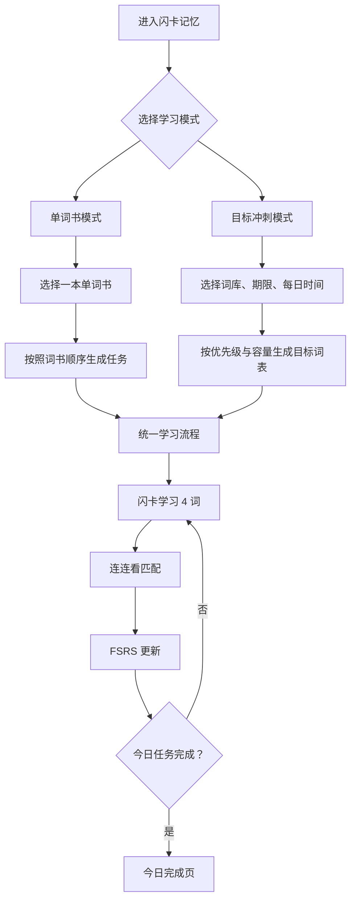

# 闪卡记忆：双模式产品方案与体验流程

> 文档版本：V2.0  
> 产品阶段：复赛深化方案  
> 产品范围：仅支持“单词书模式”和“目标冲刺模式”  
> 统一学习方式：闪卡记忆 + 连连看 + FSRS 记忆调度

---

## 一、产品决策

闪卡记忆只提供两种学习模式：

1. **单词书模式**：用户选择一本单词书，按照词书顺序从头背到尾；
2. **目标冲刺模式**：用户选择考试词库、完成期限和每日时间，系统从中挑选当前时间内最值得学习的高优先级词汇。

两种模式只有“选词方式”和“计划方式”不同，进入学习后使用完全相同的流程：

```text
闪卡学习 4 个词
→ 连连看匹配
→ 汇总本轮表现
→ FSRS 更新记忆状态
→ 进入下一组
```

产品不增加其他学习题型，不把背单词做成考试。所有功能都围绕一件事展开：

> 让用户通过简单、重复、轻松的闪卡和连连看完成长期记忆。

---

## 二、范围锁定

### 2.1 只保留两种模式

| 模式 | 用户目标 | 选词逻辑 | 是否有截止日期 |
|---|---|---|---|
| 单词书模式 | 完整背完一本词书 | 按词书顺序从头到尾 | 否 |
| 目标冲刺模式 | 在有限时间里优先背最重要的词 | 按词汇优先级和时间容量选词 | 是 |

四级、六级、考研、雅思等只是目标冲刺模式未来可以选择的不同词库或目标，不是新的学习模式。

### 2.2 只保留一种学习闭环

两个模式都只使用：

- 闪卡；
- 连连看；
- FSRS 后台调度。

### 2.3 明确不做

当前版本不加入：

- 听音辨词；
- 拼写测试；
- 语境填空；
- 选择题考试；
- 自由回忆测试；
- AI 对话练习；
- 多套互不相同的学习路径；
- 装扮型角色或复杂角色系统。

这些形式可能增加记忆深度，但也会增加考试感、操作成本和挫败感，不符合当前产品“简单、轻松、愿意反复打开”的方向。

---

## 三、产品结构



系统由三层组成：

| 层级 | 职责 |
|---|---|
| 计划层 | 决定今天从哪里取词、取多少词 |
| 学习层 | 始终执行闪卡 + 连连看 |
| 记忆层 | FSRS 保存每个词的记忆状态并安排复习 |

模式切换不会改变学习层和记忆层。

---

## 四、首页体验

### 4.1 没有学习计划时

首页只展示两个大入口。

#### 入口一：按单词书学习

标题：

> 从头背完一本词书

说明：

> 选择一本词书，按照原有顺序持续学习，直到全部背完。

按钮：

> 选择单词书

#### 入口二：按目标冲刺

标题：

> 在有限时间里先背最重要的词

说明：

> 选择目标和剩余时间，系统帮你生成一份做得完的高优先级词汇计划。

按钮：

> 创建冲刺目标

### 4.2 已有学习计划时

首页优先展示当前计划：

- 当前模式；
- 当前词书或目标；
- 今日剩余任务；
- “继续学习”主按钮；
- “更换学习计划”次入口。

更换计划不会删除原计划的进度和 FSRS 记忆数据。

---

## 五、模式一：单词书模式

### 5.1 适用场景

适合没有明确考试截止日期，希望完整、系统地背完一本词书的用户。

例如：

> 我想把四级词书从第一个词背到最后一个词，每天学习 20 个新词。

### 5.2 创建流程

```text
选择“从头背完一本词书”
→ 选择词书
→ 设置每天的新词数量
→ 确认计划
→ 开始今天的学习
```

#### 第一步：选择词书

首版可选择：

- CET4 四级；
- CET6 六级；
- TOEFL 托福；
- GRE。

#### 第二步：设置每日新词量

提供简单快捷选项：

- 10 词/天；
- 20 词/天；
- 30 词/天；
- 自定义。

系统可以显示预计完成时间，但不要求用户填写考试日期。

示例：

> 四级词书共 4,412 词。按照每天 20 个新词计算，预计约 221 个学习日完成；复习任务会由 FSRS 自动加入。

#### 第三步：确认计划

计划卡片展示：

> **四级词书 · 顺序学习**  
> 每天 20 个新词  
> 当前进度：0 / 4,412  
> 学习顺序：按词书原顺序

主按钮：

> 开始学习

### 5.3 每日取词规则

单词书模式按以下顺序生成今日任务：

1. 当前词书中已经到期的 FSRS 复习词；
2. 上一轮连连看中未掌握、需要短期重学的词；
3. 从 `nextNewIndex` 开始按词书原顺序取今日新词；
4. 已经有学习记录的词不重复计入新词数量；
5. 新词始终按原顺序推进，不按词频重新排序。

“从头背到尾”指的是新词引入顺序。FSRS 到期复习仍然可以穿插在新词之间。

### 5.4 完成状态

当 `nextNewIndex` 到达词书末尾时，显示：

> 这本词书的新词已经全部学过。

之后仍然保留到期复习，直到用户主动更换计划。不能把“看过一遍”写成“已经全部掌握”。

---

## 六、模式二：目标冲刺模式

### 6.1 适用场景

适合有明确时间限制，不打算从头背完整本词书的用户。

例如：

> 距离四级考试还有 14 天，我每天可以学习 25 分钟，希望优先背四级中优先级最高的词。

### 6.2 创建流程

```text
选择“在有限时间里先背最重要的词”
→ 选择目标词库
→ 设置完成期限
→ 设置每天可投入时间
→ 系统计算可完成的高优先级词数
→ 用户确认计划
→ 开始今天的学习
```

### 6.3 第一步：选择目标词库

MVP 只开放：

- 四级冲刺；
- 六级冲刺。

这里的“四级”和“六级”是目标词库，不是新的学习模式。两者后面的学习方式完全相同。

### 6.4 第二步：设置期限

用户可以选择：

- 7 天；
- 14 天；
- 21 天；
- 自定义截止日期。

### 6.5 第三步：设置每日时间

提供：

- 10 分钟；
- 15 分钟；
- 20 分钟；
- 25 分钟；
- 30 分钟；
- 45 分钟；
- 60 分钟。

### 6.6 第四步：生成目标

系统根据以下内容计算本期能完成多少词：

- 剩余天数；
- 每日学习时间；
- 当前词库的词汇优先级；
- 用户已有 FSRS 学习记录；
- 未来复习会占用的时间；
- 考前缓冲时间。

结果示例：

> **14 天四级高优先级词冲刺**  
> 每天 25 分钟  
> 当前时间内建议覆盖：168 个词  
> 选词范围：四级词库中优先级最高、且尚未稳定掌握的词  
> 最后 3 天：停止增加新词，以复习为主

用户可以：

- 接受推荐；
- 增加每日时间以覆盖更多词；
- 减少每日时间并接受更小的目标。

用户不需要做基础测试。已有学习记录直接复用；没有学习记录时，从优先级最高的词开始。

### 6.7 目标词汇排序

目标冲刺模式需要为词库中的每个单词提供稳定的 `priorityRank`：

- 数字越小，优先级越高；
- 优先使用经过验证的考试词频或词汇重要度数据；
- 如果数据源尚未验证，产品中只能称为“词库优先级”，不能宣传为“官方真题考频”；
- 相同优先级时按照词库中的稳定顺序排列。

系统从高到低挑选尚未稳定掌握的词，形成固定的 `targetWordIds`。

### 6.8 每日取词规则

目标冲刺模式按以下顺序生成今日任务：

1. 目标词表中已经到期的 FSRS 复习词；
2. 上一轮连连看中未掌握、需要短期重学的词；
3. 目标词表中尚未学习的新词；
4. 不从目标词表之外临时加入低优先级新词；
5. 今日到期复习过多时，先减少新词，避免任务越积越多。

### 6.9 进度变化

目标模式首页展示：

> 距离目标结束还有 11 天  
> 目标词：168  
> 已学习：62  
> 今日预计：25 分钟

如果用户漏学一天，第二天不直接把两天任务相加，而是给出两个简单选择：

1. **保持目标数量**：系统提高后续每日预计时间；
2. **保持每日时间**：系统减少尚未开始的低优先级目标词。

这不是新的学习模式，只是同一个冲刺计划的调整。

### 6.10 目标结束

截止日期到达后：

- 不再引入新词；
- 展示本期学习结果；
- 保留所有 FSRS 记忆记录；
- 用户可以继续复习，也可以创建新的单词书计划或冲刺计划。

---

## 七、两种模式共用的学习体验

无论用户从哪种模式进入，看到的学习过程都完全相同。

### 7.1 今日开始页

页面展示：

- 今日新词数量；
- 今日复习词数量；
- 预计用时；
- 当前计划名称；
- “开始今天的学习”按钮。

### 7.2 闪卡阶段

每组固定学习 4 个词。

单张闪卡展示：

- 英文单词；
- 音标；
- 中文释义；
- 例句或现有记忆辅助内容；
- “认识 / 模糊 / 不认识”三个简单反馈。

用户操作：

1. 看到单词；
2. 点击卡片翻面；
3. 查看释义；
4. 选择认识程度；
5. 进入下一张。

闪卡选择只记录为本轮临时表现，不立刻单独写入一次 FSRS 复习。

### 7.3 连连看阶段

学习完 4 个词后，立即进入连连看：

- 画面同时显示英文和中文卡片；
- 用户依次点击一张英文卡片和一张中文卡片；
- 匹配正确后两张卡片消除；
- 匹配错误时给出轻量反馈，并允许继续；
- 全部消除后完成本轮。

连连看的目标是用轻松的重复强化刚才看过的词，不把用户带入严肃考试状态。

### 7.4 本轮结果合并

连连看结束后，将闪卡反馈和匹配结果合并为每个单词的一次 `LearningResult`：

| 闪卡表现 | 连连看表现 | FSRS 评分 |
|---|---|---|
| 不认识 | 任意结果 | Again |
| 模糊 | 匹配正确 | Hard |
| 认识 | 匹配错误后改正 | Hard |
| 认识 | 一次匹配正确 | Good |

P0 不主动产生 Easy 评分，也不根据一次快速点击直接判断“完全掌握”。

每个词每轮只调用一次 `MemorySystem.rate(word, outcome)`，避免闪卡和连连看分别重复更新 FSRS。

### 7.5 下一组

本轮结束后：

- Again 的词进入短期重学队列；
- Hard 的词保留为薄弱词，由 FSRS 缩短复习间隔；
- Good 的词按照 FSRS 计算下次复习时间；
- 系统进入下一组 4 个词；
- 今日任务完成后进入完成页。

### 7.6 今日完成页

只展示简单结果：

- 今日学习时长；
- 新学词数；
- 复习词数；
- 本轮需要再次巩固的词数；
- 当前计划进度；
- “明天继续”或“再学一组”。

金币、连击和动画可以继续作为趣味反馈，但不能增加新的学习题型。

---

## 八、FSRS 与模式的关系

两种模式共享同一份单词记忆数据。

```text
模式决定：今天从哪些词中取任务
FSRS 决定：学过的词什么时候需要再次出现
闪卡 + 连连看决定：本轮应该给这个词什么记忆反馈
```

### 8.1 数据复用

例如用户先在四级单词书模式学习了 `abandon`，之后创建四级 14 天冲刺：

- 不创建第二份 `abandon` 记忆记录；
- 冲刺计划直接读取原有 FSRS 状态；
- 已稳定掌握的词不再作为冲刺新词；
- 如果它已经到期，仍然进入冲刺复习队列。

### 8.2 当前计划范围

同一时间只有一个学习计划处于 `active`：

- 单词书计划只生成当前词书的任务；
- 冲刺计划只生成目标词表的任务；
- 非当前计划不会在首页混入额外任务；
- 用户恢复旧计划时，再根据最新 FSRS 状态重新生成任务。

---

## 九、目标冲刺的容量算法

目标模式不能简单使用“目标词数 ÷ 剩余天数”，因为新词会在未来产生复习任务。

### 9.1 初始时间成本

在没有个人数据时使用：

- 新词完成一次“闪卡 + 连连看”：平均 35 秒；
- 到期复习词：平均 10 秒；
- 每日时间的 10% 留给页面切换、动画和短期重学。

### 9.2 未来复习预留

容量规划使用一个简单的影子复习表：

```text
新词学习后第 1、3、7、14 天
各预留一次 10 秒复习容量
```

影子复习只用于防止未来任务爆炸，真实复习日期仍然由 FSRS 计算。

### 9.3 目标词数生成

```text
计算每天可用秒数
→ 先预留已有 FSRS 到期复习
→ 按 priorityRank 从高到低尝试加入新词
→ 同时预留该词未来的影子复习时间
→ 任意一天超出容量时停止或跳过
→ 成功排入计划的词形成 targetWordIds
```

目标词数必须由容量计算得到，不能为了让数字好看而承诺用户在 14 天内背完不现实的数量。

### 9.4 每日动态更新

- 实际复习耗时会逐渐替代默认耗时；
- 真实 FSRS 到期任务替代影子复习预留；
- 复习任务增加时优先减少尚未开始的新词；
- 已经学过的词不能为了维持目标数字而被移出复习队列。

---

## 十、计划切换与数据保存

### 10.1 切换计划

用户点击“更换学习计划”时：

1. 当前计划变为 `paused`；
2. 用户选择单词书模式或目标冲刺模式；
3. 新计划变为 `active`；
4. 原计划进度保留，可以之后继续；
5. 单词的 FSRS 记忆数据始终全局共享。

### 10.2 删除计划

删除计划只删除：

- 计划名称；
- 选词范围；
- 每日设置；
- 计划进度。

默认不删除单词学习历史。若用户要删除全部记忆数据，需要进入单独的数据管理入口再次确认。

---

## 十一、页面清单

| 页面 | 核心内容 |
|---|---|
| 双模式首页 | 单词书模式、目标冲刺模式两个入口 |
| 单词书选择页 | 词书列表、词数、已有进度 |
| 单词书计划页 | 每日新词数、预计完成时间 |
| 冲刺目标页 | 词库、期限、每日时间 |
| 冲刺结果页 | 推荐目标词数、预计每日任务、缓冲期 |
| 当前计划主页 | 当前计划、今日任务、进度、继续按钮 |
| 闪卡页 | 每组 4 个词的学习 |
| 连连看页 | 相同 4 个词的匹配消除 |
| 今日完成页 | 今日数据和计划进度 |
| 计划管理页 | 暂停、恢复、切换、删除 |

不存在第三种学习入口，也不存在额外题型页面。

---

## 十二、核心数据结构

### 12.1 学习计划

```js
StudyPlan = {
  id: "plan_xxx",
  mode: "book", // book | goal
  status: "active", // active | paused | completed
  wordbookId: "cet4",
  createdAt: 0,
  updatedAt: 0,

  bookConfig: {
    dailyNewLimit: 20,
    nextNewIndex: 0
  },

  goalConfig: null
}
```

目标模式示例：

```js
StudyPlan = {
  id: "plan_xxx",
  mode: "goal",
  status: "active",
  wordbookId: "cet4",
  createdAt: 0,
  updatedAt: 0,

  bookConfig: null,

  goalConfig: {
    deadline: "2026-08-08",
    dailyMinutes: 25,
    priorityPolicy: "rank-ascending",
    targetWordIds: [],
    bufferDays: 3
  }
}
```

### 12.2 单词记忆

```js
WordMemory = {
  wordId: "abandon",
  difficulty: 0,
  stability: 0,
  retrievability: 0,
  lastReviewAt: 0,
  nextReviewAt: 0,
  reviewCount: 0,
  lapseCount: 0
}
```

### 12.3 本轮结果

```js
LearningResult = {
  planId: "plan_xxx",
  wordId: "abandon",
  flashcardChoice: "known", // known | fuzzy | unknown
  matchErrorCount: 1,
  matchCompleted: true,
  fsrsRating: "Hard",
  occurredAt: 0
}
```

### 12.4 今日任务

```js
DailyTask = {
  planId: "plan_xxx",
  localDate: "2026-07-25",
  newWordIds: [],
  reviewWordIds: [],
  relearnWordIds: [],
  completedWordIds: [],
  status: "in_progress"
}
```

---

## 十三、边界场景

### 13.1 单词书已经学到一半

用户恢复计划时从保存的 `nextNewIndex` 继续，不重新从第一个词开始。到期复习照常加入。

### 13.2 同一个词出现在多个词书

通过标准化 `wordId` 共享同一份记忆数据，不重复创建 FSRS 记录。

### 13.3 冲刺时间太短

系统缩小目标词数，并明确展示：

> 按照每天 20 分钟，7 天内建议优先覆盖 72 个词。

不能显示不可能完成的全量计划。

### 13.4 用户漏学

不直接累计成双倍任务。目标模式让用户选择保持目标数量或保持每日时间；单词书模式保持原每日新词上限，并优先处理到期复习。

### 13.5 今日复习过多

先减少今天的新词。若复习本身已经超出用户容量，按逾期时间排序分批完成，不无限延长当天任务。

### 13.6 目标日期到达

停止引入新词，计划标记为 `completed`，但记忆数据和继续复习入口保留。

---

## 十四、MVP 验收标准

1. 首页只出现单词书模式和目标冲刺模式两个学习入口；
2. 单词书模式可以选择词书并按原顺序持续引入新词；
3. 目标模式可以选择四级或六级、期限和每日时间；
4. 目标模式能够按优先级和跨日容量生成固定目标词表；
5. 两个模式进入完全相同的闪卡和连连看流程；
6. 页面中不存在听音、拼写、填空或其他答题模式入口；
7. 每组固定为 4 个词，完成闪卡后进入连连看；
8. 每个词每轮只汇总为一次 FSRS 更新；
9. 到期复习优先于新词，并且不会无限增加当日任务；
10. 两个模式共享单词 FSRS 记忆数据；
11. 切换计划不会丢失进度和记忆记录；
12. 刷新页面后当前计划、今日任务和学习进度仍然存在；
13. 单词书模式和目标模式都能完成“开始—学习—连连看—完成”的端到端流程；
14. 至少有一条自动化测试分别覆盖两种模式的完整主路径。

---

## 十五、复赛演示流程

### 0:00～0:25：展示两种选择

打开首页：

- 从头背完一本词书；
- 在有限时间里先背最重要的词。

一句话说明：

> 两种模式只改变选哪些词，真正学习时都使用同一套闪卡、连连看和 FSRS。

### 0:25～0:55：展示单词书模式

- 选择四级词书；
- 设置每天 20 个新词；
- 展示按词书顺序推进和已有进度；
- 返回首页保留计划。

### 0:55～1:25：创建 14 天冲刺

- 选择四级；
- 选择 14 天；
- 选择每天 25 分钟；
- 系统生成高优先级目标词表；
- 展示未来复习容量已经被计算在内。

### 1:25～2:25：完成一轮学习

- 学习 4 张闪卡；
- 进入相同 4 个词的连连看；
- 一个词一次正确；
- 一个词先匹配错误再改正；
- 完成本轮。

### 2:25～2:50：展示 FSRS 结果

- 一次正确的词得到 Good；
- 先错后对的词得到 Hard；
- 每个词只写入一次 FSRS；
- 系统安排下一次复习。

### 2:50～3:00：总结

> 想完整学习，就从头背完一本词书；时间有限，就只学最重要的词。无论选择哪种方式，用户只需要轻松地翻闪卡、玩连连看，复杂的记忆安排全部交给后台。

---

## 十六、对外产品表达

### 一句话定位

> 想完整背，就选一本词书从头学到尾；时间有限，就让系统先挑最重要的词。

### 核心学习体验

> 翻 4 张闪卡，玩一轮连连看，剩下的复习安排交给 FSRS。

### 产品原则

> 模式可以不同，学习体验必须始终简单。

